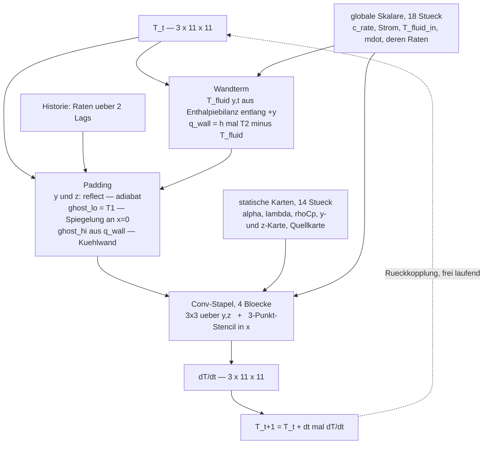
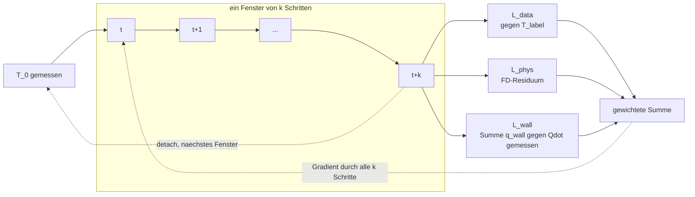

# GridCNN — das Feld auf einmal, statt Punkt für Punkt

> **Status: Entwurf, kein Code.** Diese Datei ist die Design-Diskussion.
>
> **02.09. — die Geometriefragen sind beantwortet** (Auskunft aus der Doku, plus
> Nachprüfung im Code). Damit stehen die Randbedingungen und das x-Layout
> (§5), und der Wandterm ist als *die* fehlende Bilanzhälfte bestätigt (§6).
> Offen ist nur noch, wie groß `f` sein muss — dafür der Rangtest in §8.

Ein zweiter, **unabhängiger** Modellansatz neben
[`PINNmodulusTwo/`](../PINNmodulusTwo/). Nicht dessen Ersatz: dasselbe Datum,
derselbe Split, dieselben Metriken, damit die beiden vergleichbar sind — aber
eigenes Modell, eigenes Training, eigener Verlust.

---

# ▶ Stand der offenen Punkte

Alle sechs vom 02.09. sind beantwortet. Was jetzt noch offen ist, steht in §12.

| # | Frage | Antwort |
|---|---|---|
| 1 | Rangtest oder `model.py` zuerst? | **Rangtest.** `tools/spatial_rank.py` ist geschrieben und getestet — läuft bei dir in Sekunden, braucht nur numpy. §8 |
| 2 | Läuft PINNmodulusTwo parallel? | **Ja**, Achse 0 läuft/lief. Ich brauche die Zahl, siehe §12 |
| 3 | Name `GridCNN`? | bleibt |
| 4 | `subsample_time` 2 oder 1? | **2.** Zwei Gründe: ~20 % Luft zum CFL-Limit (0.2 gegen 0.241 s), und Schritt 6 lief auf `2` — nur so ist der Vergleich gegen die 6.270 / 3.585 C ein Vergleich. `1` ist die Gegenprobe, falls `L_phys` sich auffällig verhält |
| 5 | Wand-BC in den Fahrplan? | erklärt unten |
| 6 | Fluidtemperatur an der Wand | **beides.** Bilanz im Modell, gemessene Werte als Aufsicht und Gegenprobe. §5/§6 — und dort steht auch die Falle |

## Zu 5: was ich damit meinte

Es geht **nicht** um GridCNN, sondern um einen Befund über **`PINNmodulusTwo`**.

`grep -rin "convect|robin|htc|h_conv|wall.*flux"` über `physics.py`, `model.py`
und `train.py` findet nichts. `heat_residual` ist reine Leitung plus Quelle,
ohne Senke, und der einzige BC-Term sitzt per `bc_mask = |x| < 1e-6` an der
Symmetrieebene. Also: **die Gehäusewand hat gar keine Randbedingung.** Der
Wärmeaustritt ist physikalisch unbeschränkt und wird allein aus dem Datenterm
gelernt — obwohl dort laut Energiebilanz bis zu die Hälfte der Quellenergie
hinausgeht.

Das ist ein offener Punkt in *deinem* Fahrplan, nicht in meinem Entwurf. Mein
Vorschlag: als **O16** in Teil I, mit der Einschränkung dazu, dass er die
val-Fehler **nicht** erklärt (§11.5 sagt, V̇ = 0 ist der *schwierigere* Fall,
also bleibt es dafür bei O14). Sag „ja", dann trage ich ihn in
`PINNmodulusTwo/FAHRPLAN.md` ein — es ist deine Datei und die O-Nummern sind
deine Buchführung, deshalb frage ich statt es zu tun.

---

# Der Entwurf

## Warum der Name

`Grid`, weil das die tragende Eigenschaft ist (siehe unten: das Gitter ist
strukturiert und über alle OPs identisch — ohne das ginge kein CNN), `CNN` für
die Architektur. Ein `git mv` kostet nichts, falls dir etwas Besseres einfällt.

---

## 1. Die Voraussetzung: das Gitter ist strukturiert

Ausgezählt aus `legacy/battery_surrogate_agenticWorkflow/coordinates/`:

| Layer | x | Punkte |
|---|---|---|
| Cell Center | 0.0 (Symmetrieebene) | 121 |
| JR1 Center | 0.010786 m | 121 |
| Gehäusewand | 0.021900 m | 121 |

Alle drei Layer haben **exakt dieselben 11 y- und 11 z-Werte**, äquidistant:

* Δy = 19.809 mm (−98.91 mm … +99.18 mm)
* Δz = 10.444 mm (−52.26 mm … +52.18 mm)
* in x: 10.786 mm und 11.114 mm — 3 % Unterschied, also fast äquidistant

**Und der äußere Ring ist die Domänengrenze.** Der `legacy`-PINN-README sagt
*„Face spans `dy=0.198 m`, `dz=0.104 m`"*; das Raster spannt gemessen
0.198089 m × 0.104441 m — beides exakt die README-Werte auf drei Stellen. Das
Raster liegt also **Kante auf Kante auf der Zellfläche**, nicht irgendwo innen
drin. Damit gilt am Randring eine echte Randbedingung, und Padding ist das
richtige Mittel (§5).

Also ein **3 × 11 × 11 Tensorgitter, identisch über alle sechzehn OPs**.
`data.Tn` ist `(n_t, 363)` und wird mit *einem* `reshape` zu `(n_t, 3, 11, 11)`.
Kein Vernetzen, kein Interpolieren.

**Layout:** gefaltet wird über (y, z) — dort liegen die 11×11 äquidistanten
Punkte. Wie x behandelt wird, ist die eine offene Layout-Frage: als Kanäle
(einfach, aber dann sind die Randbedingungen nicht strukturell) oder als kurze
Achse mit Geisterschichten (beide BCs exakt). **Siehe §5** — die Antwort hängt
an den Randbedingungen und nicht am Geschmack.

---

## 2. Was tatsächlich für den CNN spricht

Das Tempo-Argument trägt **nicht** — `rollout()` in `PINNmodulusTwo/model.py`
batcht alle 363 Punkte schon in einen MLP-Forward pro Zeitschritt. Pro Schritt
sind beide grob gleich teuer. Was bleibt:

**a) Die Diffusion wird Architektur statt Strafterm.** Im punktweisen
Koordinaten-MLP gibt es zwischen zwei Nachbarpunkten *keinerlei* Kopplung. Dass
das Feld zusammenhängt, kommt allein aus `L_phys`. Ein 3×3-Kernel auf einem
äquidistanten Gitter **ist** ein FD-Stencil — der Nachbar ist dann eingebaut,
nicht anerzogen.

**b) Statische Karten werden Pflicht, nicht Kür — und das ist gut.** Weil der
Kernel über (y, z) geteilt wird, *kann* der CNN Position nicht auswendig
lernen. Das MLP bekommt (x, y, z) und darf; genau daher kommt ein Teil seiner
guten In-Sample-Zahlen (OP01: 1.000 C) bei mäßiger Verallgemeinerung. Der CNN
muss räumliche Struktur über die Materialkarten begründen. Das ist der
schärfere Prior.

**c) Die Symmetrie wird Struktur statt Gewicht.** `dT/dx = 0` an der Zellmitte
ist eine Spiegelung -- exakt, ohne `w_bc`, Achse 2 des Fahrplans löst sich auf.
Das gilt aber nur mit der Geisterschicht-Variante aus §5, nicht wenn x einfach
in den Kanälen liegt. Die Gehäusewand ist **kein** Nullgradient und braucht
einen eigenen Term (§6).

**d) Der Physik-Stencil wird ein fester Kernel.** Kein Autograd-Hessian im
Raum mehr, damit auch `tf32: false` hinfällig, und O8 / der `[CFL WARN]` sind
direkt adressierbar statt über einen Hyperparameter `delta_phys`.

**e) Truncated BPTT wird bezahlbar.** Das ist das eigentliche Speicher-Argument
und der einzige Punkt, an dem der CNN in einer harten Ressource gewinnt —
Begründung in §4.

---

## 3. Der Input

Layout je Zeitschritt: `(C, 11, 11)`, x in den Kanälen.

### 3a. Zustand und Historie — 6 bis 9 Kanäle

| Block | Kanäle | was |
|---|---|---|
| `T_t` | 3 | das normierte Feld jetzt (die 3 x-Ebenen) |
| `T_t − T_{t−Δ1}` | 3 | Rate über kurzem Lag |
| `T_t − T_{t−Δ2}` | 3 | Rate über langem Lag *(optional)* |

Das ist bewusst die **Hybrid-Historie aus `model.py`** (1 Anker + eine Rate je
Lag), nur feldweise statt punktweise. Damit ist der Vergleich zum bestehenden
Modell eine Architekturfrage und keine Featurefrage.

### 3b. Die Quelle — 0 zeitabhängige Kanäle

`data.py:594` baut sie so:

```python
Qsrc = r["q_dot"][:, None] * q_mask[None, :] * T_span_ref / (rho * Cp * T_sigma)
```

`q_dot(t)` ist **ein Skalar je Zeitschritt** (JR1-Gesamtleistung / V_JR1),
`q_mask` ist die JR1-Ebene, `ρCp` ist statisch. Also:

> **`Qsrc` = Skalar(t) × feste Ortskarte.** Das räumliche Muster ist über die
> ganze Trajektorie konstant, nur die Amplitude bewegt sich.

Damit fällt der Block auf **eine statische Karte** (`q_mask/(ρCp)`) plus den
Skalar `q_dot_z(t)`, der ohnehin schon in `n_forcing` steckt. Keine
zeitabhängigen Feldkanäle.

**Die Folge ist größer als die eingesparten drei Kanäle:** der *einzige*
räumlich strukturierte und gleichzeitig zeitabhängige Input ist `T` selbst.
Alles andere ist statische Karte × globaler Skalar. Das macht den Rangtest in
§8 noch schärfer — wenn nichts Zeitabhängiges räumliche Struktur einträgt,
kann das Feld kaum hochrangig sein.

### 3c. Statische Karten — konstant, ~14 Kanäle

Konstant über Zeit *und* über alle OPs, also einmal berechnet und
durchgereicht. Alles schon in `data._grid_arrays` / `_static_features` da:

| Block | Kanäle | Anmerkung |
|---|---|---|
| α (Temperaturleitfähigkeit) | 3 | z-scored, wie heute |
| λ_xx, λ_yy, λ_zz | 9 | die Anisotropie, je x-Ebene |
| ρ·Cp | 3 | |
| y-, z-Koordinatenkarte | 2 | gegen die Translationsäquivarianz am Rand |
| `region` (CC/JR1/Housing) | **0** | **redundant** — das ist der Kanalindex |

`region` fällt weg, weil x in den Kanälen steckt. Ein Beispiel dafür, dass das
Layout Features spart statt welche zu kosten.

### 3d. Globale Treiber — 18 Skalare

Die `n_config = 7` (`CONFIG_ORDER`) plus `n_forcing = 11` (`q_dot_z` + fünf
Treiber × zwei kausale Rate-Lags) aus `data.py`, unverändert.

**Zwei Wege, sie einzuspeisen:**

1. **Broadcasten** als konstante 11×11-Kanäle. Fünf Zeilen, und bei 121 Pixeln
   kostet es nichts. **Für die erste Version.**
2. **FiLM-Konditionierung**: ein kleines MLP bildet die 18 Skalare auf (γ, β)
   je Feature-Kanal ab, die nach jedem Conv skalieren und verschieben.
   Ausdrucksstärker, kaum mehr Code. **Als erste dokumentierte Erweiterung**,
   damit sie eine eigene Sweep-Achse ist und nicht mit der Architektur vermischt.

**Zwei davon gehen zusaetzlich woanders hin.** `fluid_inlet_temp` und
`fluid_mass_flow` sind nicht nur globale Skalare -- sie sind die
Gehaeusewand-Randbedingung (§5, §6). Sie werden also *auch* broadcastet, aber
ihre eigentliche Wirkung hat der Wandterm.

**Nicht drin: die absolute Zeit.** Bewusst. Ein `t / T_span`-Kanal lädt das Netz
ein, die Uhr der Trajektorie auswendig zu lernen statt Dynamik — bei elf
Trajektorien wäre das der billigste Weg zu guten In-Sample-Zahlen und die
teuerste Art, OP06 zu verfehlen.

### Summe

| | Kanäle |
|---|---|
| Zustand + Historie | 6–9 |
| Quelle | 3 |
| Statik | 14 |
| Treiber (broadcast) | 18 |
| **Input gesamt** | **41–44** |

Bei 11×11 ist das nichts. Mit FiLM statt Broadcast: 23–26.

---

## 4. Die Rekurrenz

**Ja, geht — und der interessante Teil ist, dass das heutige Training gar keine
echte Rekurrenz trainiert.**

### Was PINNmodulusTwo heute tut

`train.py:772` rollt **unter `torch.no_grad()`** einmal je OP je Epoche aus,
friert die Trajektorie ein, und macht darauf `inner_steps` Minibatch-Updates auf
(t, Punkt)-Paaren. Der Kommentar dort sagt es selbst: die Rekurrenz „detached
its history between steps (truncated BPTT)". Es ist also **Ein-Schritt-Training
gegen die eigene eingefrorene Trajektorie** — DAgger-artig, kein BPTT.

Das ist eine gute Entscheidung gewesen (sie hat die Update-Zahl von 300 auf
`inner_steps × Epochen` gehoben). Aber sie hat eine strukturelle Grenze:

> **Ein Verfahren, das nur Ein-Schritt-Fehler sieht, kann O13 nicht beheben.**
> O13 ist „der Fehler wächst zum Trajektorienende" (OP06: 6.270 C im Mittel,
> 13.248 C spät). Das ist per Definition ein Mehr-Schritt-Fehler. Der Gradient
> sieht ihn nie.

### Warum der CNN das ändern kann

Aktivierungsspeicher je Rollout-Schritt, grob:

* MLP: 4 Layer × 128 Breite × 363 Punkte ≈ **186 k** Floats
* CNN: 4 Layer × 64 Kanäle × 121 Pixel ≈ **31 k** Floats

Rund **6-fach leichter**, plus der Graph der differenzierbaren
Historien-Interpolation (`interp_history`) fällt weg. Damit wird **truncated
BPTT über 50–200 Schritte** bezahlbar, und das ist der direkte Hebel auf O13.
Das ist der einzige Punkt, an dem der CNN in einer harten Ressource gewinnt —
und er zielt auf genau den offenen Punkt, den die heutige Trainingsschleife
nicht erreichen kann.

### Die drei Stufen, in der Reihenfolge

| Stufe | Form | wann |
|---|---|---|
| **1 — Markov-Schritt** | `T_{t+1} = T_t + Δt · f(T_t, Raten, Qsrc_t, Treiber_t, Statik)` | **zuerst.** Exakt parallel zum heutigen Modell, damit der Vergleich eine Architekturaussage ist |
| 2 — ConvGRU | gelernter versteckter Zustand `h_t` statt expliziter Lags | erst wenn 1 steht. Der Zustand ist unbeschränkt und kann driften; bei elf Trajektorien ist das ein echtes Risiko |
| 3 — Neural ODE / Mehrschritt-Integrator | | nicht absehbar nötig |

### Die Δ-Form und warum sie hier gehen sollte

`residual_output` ist in PINNmodulusTwo **aus**, weil es „den Level durch einen
Integrator mit Gain exakt 1 ohne Leck trägt und jeden Rollout weglaufen lässt".
Stufe 1 oben ist genau diese Δ-Form. Der Unterschied: ein Diffusions-Kernel ist
**dissipativ** — er liefert das fehlende Leck von selbst, was ein punktweises
MLP nicht kann.

**Das ist eine Hypothese, keine Messung.** Sie ist mechanistisch begründet und
sie ist billig zu widerlegen: läuft der Rollout weg, war sie falsch. Der
`[SATURATED]`-Zähler aus `train.py` wird mitgenommen, damit man es sieht statt
es zu erraten.

### CFL

Die Δ-Form mit explizitem Stencil ist explizites Euler, also CFL-gebunden.
`config.yaml` steht auf `subsample_time: 2` → dt = 0.2 s bei einem
Δt_max ≈ 0.241 s. Das ist **knapp innerhalb**, mit 20 % Luft. Zwei Anmerkungen:

* `f` ist gelernt, nicht der wahre Stencil — das Netz ist nicht streng an die
  CFL des echten Diffusionsoperators gebunden.
* Für den **Physik-Residuen-Term** gilt sie aber schon. Wenn der Term bei
  dt = 0.2 s getragen werden soll, ist `subsample_time: 1` der sichere Wert.

---

## 5. Randbedingungen — geklaert (02.09.)

Beantwortet aus der Doku (`legacy/battery_surrogate_agenticWorkflow_PINN/README.md`)
plus Nachpruefung im Code. Alle drei Flaechen sind jetzt entschieden.

| Flaeche | was gilt | im CNN |
|---|---|---|
| x = 0, Zellmitte | **Symmetrieebene.** Der README sagt *„Half-model of a prismatic cell"*, Domaene `Box([0,ymin,zmin],[0.0219,ymax,zmax])`. x = 0 … 0.0219 ist die halbe Zelldicke | `ghost_lo := T1` — Spiegelung, exakt |
| x = 0.0219, Gehaeusewand | **Domaenengrenze, hier tritt Waerme aus.** Kuehlplatten liegen auf den ±x-Flaechen bei x = ±0.0238, also 1.9 mm dahinter | `ghost_hi` aus dem konvektiven Fluss (§6) |
| y/z-Umfang | **adiabat / Symmetrie.** Die Kuehlung sitzt nur auf ±x; die Coolant-Inlets bei y = −0.1265 / +0.14605 liegen im Fluidkanal der Kuehlplatte, nicht an der Zellseitenflaeche. Im Modul liegt seitlich die Nachbarzelle | **`reflect`-Padding** |

Und, weil §1 es misst: der Randring liegt **auf** der Flaechenkante
(0.198089 × 0.104441 m gegen `dy=0.198`, `dz=0.104` im README). Der Randknoten
sitzt also auf der Grenze, nicht davor.

> **Korrektur an der Auskunft.** Die Antwort auf Frage 1 lautete „vermutlich ein
> separates Probe-Raster, nicht die Domaenengrenze", begruendet damit, dass die
> Coolant-Flaechen bei y = −0.1265 / +0.14605 weit ausserhalb des Rasters
> liegen. Das stimmt, ist aber kein Beleg: diese Flaechen gehoeren zum
> **Fluidkanal in der Kuehlplatte**, der als Zu- und Ablauf ueber die Zelle
> hinausragt — nicht zur Zellkontur. Die Zellkontur steht zwei Absaetze weiter
> oben im selben README und stimmt mit dem Raster ueberein.

### Warum `reflect` und nicht `replicate`

Weil der Randknoten **auf** der Grenze liegt und dort `dT/dn = 0` gilt:

* `reflect` spiegelt um den Randknoten, Geist := erster innerer Knoten. Die
  zentrale Differenz ueber den Randknoten wird damit **exakt null**. Das ist die
  uebliche Art, eine Neumann-0-Bedingung auf einem knotenzentrierten Gitter zu
  setzen.
* `replicate` setzt Geist := Randwert. Das ist ein *einseitiger* Nullgradient,
  eine groebere und andere Diskretisierung derselben Bedingung.

Mein Vorschlag aus der letzten Runde (`replicate`) war die vorsichtige Wahl
unter Unwissen. Mit der geklaerten Geometrie ist `reflect` die richtige.

### Das Layout ist damit entschieden: x als kurze Achse

Laege x in den Kanaelen, gaebe es in x kein Padding und **keine** der beiden
x-Bedingungen waere strukturell — die Symmetrie muesste als Strafterm
zurueckkommen, wie heute. Also:

```
x-Stapel, 5 tief:   [ghost_lo,  T0(Mitte),  T1(JR1),  T2(Wand),  ghost_hi]

ghost_lo := T1                                  # Spiegelung an x=0 -- exakt
ghost_hi := T2 - (dx2 / lam_xx) * q_wall        # konvektiver Austritt
q_wall   := h(V_dot) * (T2 - T_fluid(y, t))     # y, nicht nur t -- siehe unten

y/z:  reflect-Padding, beide Richtungen
```

Gefaltet wird ueber (y, z); in x laeuft ein expliziter 3-Punkt-Stencil ueber den
gepaddeten Stapel, ein Schritt je Block (drei Ebenen sind zu flach zum Stapeln).

### Zwei Details, die man nicht naiv machen darf

**Der x-Abstand ist nicht aequidistant.** Δx₁ = 10.786 mm (Mitte→JR1),
Δx₂ = 11.114 mm (JR1→Wand), 3 % Unterschied. An Ebene 0 ist der gespiegelte
Stencil *uniform* (Δx₁ beidseitig), an Ebene 2 per Konstruktion auch (Δx₂). Nur
**Ebene 1 braucht die nicht-aequidistante Zweite-Ableitungs-Formel** — die
naive Form `(T₀ − 2T₁ + T₂)/Δx²` mischt dort einen Erste-Ableitungs-Anteil von
~3 % ein.

**λ_XY ist auf JR1 nicht null.** Der README fuehrt fuer JR1 `XX/XY/YY` aus CSV
(nur `XZ = YZ = 0`), und `physics.py:171` kontrahiert entsprechend voll:

```python
aniso = fo00*Txx + fo11*Tyy + fo22*Tzz + 2*(fo01*Txy + fo02*Txz + fo12*Tyz)
```

`Txy` ist eine **gemischte Ableitung ueber die kurze x-Achse und eine
Faltungsachse**. Als FD ist das ein Kreuz-Stencil ueber den ghost-gepaddeten
Stapel — machbar, aber es ist die eine Stelle, an der die FD-Variante fummeliger
ist als der Autograd-Hessian, den sie ersetzt. Nicht vergessen und nicht
stillschweigend weglassen: `fo01` ist genau auf der geheizten Ebene ungleich
null.

## 6. Der Wandterm — und die Falle darin

`grep -rin "convect|robin|htc|h_conv|wall.*flux"` ueber `PINNmodulusTwo/*.py`
findet **nichts**. `heat_residual` ist reine Leitung plus Quelle, ohne Senke,
und der einzige BC-Term sitzt an der Symmetrieebene. Der Waermeaustritt an der
Gehaeusewand ist voellig unbeschraenkt -- er wird allein aus dem Datenterm
gelernt.

Genau das sieht `energy_balance_report`: **0.5-0.9x, und es folgt dem
Volumenstrom.** V_dot = 0 -> 0.9x (fast nichts geht raus), V_dot = 0.0026 ->
0.5x. Und weil die Kuehlung nur auf ±x sitzt (§5), ist `ghost_hi` **der**
einzige Weg, auf dem Energie das Gebiet verlaesst. Der Term ist keine
Verbesserung unter mehreren, er ist die fehlende Haelfte der Bilanz.

### Was der 02.09. dazu geliefert hat

Die Auskunft (`030`) hat vier Groessen im **Rohexport** gefunden, die in keiner
Cache-Pipeline referenziert sind:

| Datei | Spalte | was |
|---|---|---|
| `*_Temperaturen.csv` | `Tmfavg_fluid_out Monitor (C)` | massenstromgemittelte **Auslasstemperatur**, gleiche Zeitachse (dt = 0.1 s) |
| `*_Heat Transfer.csv` | `Heat Transfer: solid to fluid Monitor (W)` | **der gemessene Waermestrom Festkoerper -> Fluid, `Q̇(t)`** |
| `*_Fluidstoffwerte.csv` | `Specific Heat Monitor (J/kg-K)` | `Cp_fluid` (OP04: 3374.09) |
| `*_Input Signale.csv` | `Fluid Mass Flow Monitor (kg/s)` | `ṁ` |

Die zweite Zeile ist der eigentliche Fund. **`Q̇(t)` ist gemessen** — genau die
Groesse, die `ghost_hi` berechnet.

### ⚠ Die Falle: das sind keine Eingaben

`Q̇(t)` und `Tmfavg_fluid_out(t)` sind **Ergebnisse der Simulation**, nicht
Treiber. Ein Surrogat, das die Simulation ersetzen soll, hat sie zur Laufzeit
**nicht**. Sie als Modelleingang zu fuehren waere ein Leck: hervorragende
val-Zahlen und ein Modell, das im Einsatz nichts kann.

Also sauber getrennt:

| Groesse | Rolle | zur Laufzeit verfuegbar? |
|---|---|---|
| `ṁ`, `T_fluid_in`, `Cp_fluid` | **Eingang** | ja, sind Treiber bzw. Konstante |
| `Q̇(t)` gemessen | **Aufsicht im Training** (`L_wall`) und Kalibrierung von `h` | nein — steht nur im Training zur Verfuegung |
| `Tmfavg_fluid_out(t)` | **Gegenprobe** der Bilanz | nein |

### Was das Modell tatsaechlich rechnet

Geschlossen, ohne einen einzigen freien Parameter im Fluidpfad:

```
# 1. Fluidtemperatur laengs der Wand -- Enthalpiebilanz entlang +y.
#    Das Kuehlmittel fliesst entlang +y und erwaermt sich dabei, die Wand
#    sieht also bei kleinem y kaelteres Fluid als bei grossem.
T_fluid(y, t) = T_in(t) + Q_kumuliert(y, t) / (mdot(t) * Cp_fluid)
                          ^ Integral der Wandwaerme von y_min bis y

# 2. Wandfluss aus der lokalen Differenz
q_wall(y, z, t) = h(t) * (T2(y, z, t) - T_fluid(y, t))

# 3. Geisterschicht daraus
ghost_hi = T2 - (dx2 / lam_xx) * q_wall
```

`h` ist dabei **kalibriert, nicht geraten und nicht frei gelernt**: aus dem
gemessenen `Q̇(t)`, der Wandtemperatur und `T_fluid` faellt

```
h_eff(t) = Q̇(t) / (A * (T2_mittel(t) - T_fluid_mittel(t)))
```

direkt heraus. Einmal offline ueber alle OPs gerechnet, gegen `V_dot`
aufgetragen, ergibt das eine **feste Funktion `h(V_dot)`**, die zur Laufzeit
verfuegbar ist. Kein freier Parameter, und bei elf Trajektorien zaehlt jeder,
den man nicht braucht.

> Falls die Punktwolke `h_eff` gegen `V_dot` nicht auf einer Kurve liegt, ist
> `h` nicht allein flussabhaengig. Dann -- und nur dann -- wird `h` gelernt,
> aber weiterhin mit `L_wall` gegen `Q̇` beaufsichtigt.

### Die zwei Gegenproben, die dadurch gratis sind

```
L_wall  :  Summe(q_wall * dA)  gegen  Q̇_gemessen(t)      # Verlustterm
Probe   :  T_fluid(y_max, t)   gegen  Tmfavg_fluid_out(t) # nur Diagnose
```

Der zweite laeuft ohne Modell: beide Seiten kommen aus denselben Rohdaten. Er
sagt vor dem ersten Training, ob die Bilanz ueberhaupt aufgeht.

> **Was das NICHT erklaert.** §11.5 sagt, V_dot = 0 sei der *schwierigere* Fall
> (Mittel 5.374 C gegen 2.928 C bei V_dot > 0), und der schlechteste
> ausgehaltene OP ist OP06 -- ohne Kuehlung. Waere der fehlende Wandterm die
> Ursache der val-Fehler, muesste es andersherum sein. Es bleibt bei O14:
> Abdeckung, nicht Physik.

### Kostet einen Cache-Umbau

Die vier Groessen liegen roh vor, aber nicht im `.npz`. Fuer die reine
Gegenprobe reicht direktes Einlesen der CSVs; fuer das **Training** muessen
`Q̇(t)`, `T_fluid_out(t)`, `Cp_fluid` und `mdot` ins Buendel — also
`schema_version` hoch, `opbundle_contract.md` erweitern, alle sechzehn OPs neu
bauen (10-30 min). Das ist ein Eingriff in geteilte Infrastruktur und gehoert
in den Plan, nicht nebenbei erledigt. Siehe [`GridCNN/FAHRPLAN.md`](FAHRPLAN.md), Stufe 2.

## 7. Das Flussdiagramm

### Ein Rollout-Schritt



Drei Dinge, die das Bild sagen soll:

* **Die Randbedingungen sitzen VOR dem Netz, nicht in einem Verlustterm.** Was
  aus `P` herauskommt, erfuellt Symmetrie und Kuehlwand bereits — das Netz kann
  sie nicht verletzen und muss sie nicht lernen.
* **Der Wandterm haengt an `T_t` selbst**, nicht nur an den Treibern. Er ist
  eine Rueckkopplung: heisse Wand, mehr Abfuhr.
* **Die Rueckkopplung ist frei laufend.** Kein Teacher Forcing, genau wie in
  `PINNmodulusTwo`.

### Der Trainingsschritt



Der Unterschied zu `PINNmodulusTwo` steckt im gestrichelten Pfeil links: dort
laeuft der Gradient **einen** Schritt weit (`train.py:772` rollt unter
`no_grad` aus und trainiert dann Ein-Schritt-Paare gegen die eingefrorene
Trajektorie), hier `k`. Das ist der Hebel auf O13 — §4.

`L_wall` ist der dritte Term und der einzige mit einem **gemessenen** Ziel:
`Q̇(t)` aus dem Rohexport. Er ist im Training verfuegbar und zur Laufzeit nicht,
was genau richtig ist — §6.

## 8. Was von PINNmodulusTwo übernommen wird

Unabhängiges **Modell**, geteilter **Datenpfad**. Das ist Absicht:

`data.py` trägt die teuer erkauften Korrekturen — die 121×-Quelle (§11.1), die
Energiebilanz, die gepoolte Normierung, das anti-aliasing beim
Treiber-Resampling, die vier Reports. Eine Kopie davon driftet weg, und genau
deshalb sind am 31.08. die beiden Vorgängerprojekte zusammengelegt worden. Der
Fehler wird nicht wiederholt.

| übernommen (importiert, nicht kopiert) | neu in `GridCNN/` |
|---|---|
| `data.py` — Laden, Normierung, Reports | `model.py` — der Conv-Kern |
| `op_registry.py` — Split und Tiers | `physics.py` — FD-Stencil statt Autograd |
| `op_metrics.py` — MAE/RMSE/peak/late je OP | `train.py` — Rollout mit truncated BPTT |
| die trivialen Vorhersager | |
| die Abbruch- und Auswahlregeln | |

Der Split bleibt **identisch** (train 11 / val OP06+OP09 / test OP13, OP15,
OP16), sonst ist der Vergleich wertlos.

---

## 9. Der Rangtest — das Werkzeug steht

[`tools/spatial_rank.py`](tools/spatial_rank.py), geschrieben und gegen ein
nachgebautes Buendel getestet. Braucht **nur numpy** — kein Torch, kein pandas,
keine `material_properties/`, weil es `T`, `xyz` und `layer` roh aus dem `.npz`
liest.

```bash
python3 GridCNN/tools/spatial_rank.py
```

Es rechnet drei POD-Zerlegungen, weil sie drei verschiedene Fragen beantworten:

| | Frage |
|---|---|
| `T` − Zeitmittel je Punkt | wie viele Moden beschreiben die Dynamik? |
| `T` − **Orts**mittel je Zeit | wie viel bleibt, wenn man „die ganze Zelle wird waermer" abzieht? **Daran haengt die Faltung.** |
| dasselbe **gepoolt** ueber alle OPs | traegt EINE Basis alle OPs? Das ist die Zahl, die zaehlt — ein Modell, das je OP eine eigene Basis braeuchte, verallgemeinert nicht |

Dazu zwei Kontrollen, die nichts extra kosten: die **Gitterprobe** (der
`reshape` auf `3 x 11 x 11` wird aus den Koordinaten *abgeleitet*, nicht
geraten) und das **Wandgefaelle je OP** neben dem Volumenstrom — waechst es mit
`V_dot`, sitzt die Senke wirklich an der Gehaeusewand, wie `ghost_hi` annimmt.

Die Lesart:

| gepoolte Ortsstruktur bei 99.9 % | heisst |
|---|---|
| **≤ ~5 Moden** | der Raum ist trivial. Ein 5-Moden-ROM ist die ehrlichere Antwort als ein CNN, und `f` darf sehr klein sein |
| **~30+ Moden** | echte Ortsstruktur, die Faltung hat etwas zu holen |

> Eine Fussangel steht auch im Skript: sobald der `uniform`-Anteil nahe 100 %
> liegt, ist die Ortsstruktur selbst klein und die letzten 0.01 % sind
> Rauschen. Eine dreistellige Modenzahl in der 99.99-%-Spalte zaehlt dann
> Rauschen, nicht Physik — immer neben dem `uniform`-Anteil lesen.

Der Test entscheidet nicht, *ob* GridCNN gebaut wird — die Argumente in §2
haengen nicht daran. Er entscheidet, **wie gross `f` sein muss**, und bei elf
Trajektorien ist das keine Nebenfrage.

## 10. Was der CNN nicht repariert

Damit es geschrieben steht und nicht später als Überraschung auftaucht:

* **Elf Trajektorien.** OP06s 6.270 C ist laut §11.5 ein Envelope-Problem
  (O14): „keine Kühlung bei mittlerer Starttemperatur" kommt im Training nicht
  vor. Keine Architektur erfindet Daten.
* **O11 / OP19.** Der Sim-vs-Messung-Abstand wird davon nicht kleiner.
* **Das ~1 K-Ziel.** Wenn der Engpass die Abdeckung ist und nicht die
  Architektur, verschiebt der CNN die Zahl, aber nicht die Ursache.

---

## 11. Was gegen diese Idee spricht

Selbstpruefung, weil danach gefragt wurde — und weil ein Entwurf, der nur seine
eigenen Argumente auffuehrt, keiner ist.

### 11.1 Der groesste Einwand: die meisten Gewinne sind KEINE CNN-Gewinne

Ich habe in §2 sechs Punkte fuer den CNN aufgezaehlt. Beim Nachrechnen halten
nur zwei davon der Frage stand *„braucht das wirklich eine Faltung?"*:

| Gewinn | braucht dafuer wirklich einen CNN? |
|---|---|
| `reflect`-Padding, exakte Symmetrie | **nein** — braucht das *Gitter* |
| `ghost_hi` / Wandterm | **nein** — braucht das *Gitter* |
| FD-Stencil statt Autograd-Hessian | **nein** — braucht das *Gitter* |
| bezahlbares truncated BPTT | **nein** — braucht *Feld auf einmal* |
| statische Karten werden Pflicht | ja, das ist Gewichtsteilung |
| Diffusion als Architektur (3x3 = Stencil) | ja |

**Vier von sechs bekommt man genauso mit einem dichten Netz auf dem
363-Vektor** — oder mit einem ROM. Ich habe „nutze die Gitterstruktur" als
„nutze einen CNN" verpackt, und das sind zwei verschiedene Behauptungen. Die
Faltung selbst ist der am schwaechsten begruendete Teil des Vorschlags.

### 11.2 Der Rangtest kann genau die Faltung erledigen

Und das ist nicht unwahrscheinlich. Drei Befunde zeigen in dieselbe Richtung:

* das Feld ist diffusiv und wird von glatten globalen Skalaren getrieben,
* `Qsrc` ist Skalar(t) x fester Karte (§3b) — die Quelle traegt **null**
  zeitabhaengige Ortsstruktur,
* damit ist `T` selbst der einzige raeumlich strukturierte zeitabhaengige
  Input.

Wenn dabei fuenf Moden herauskommen, ist ein CNN mit vierzehn statischen Karten
zum Brechen der Translationsaequivarianz ein umstaendlicher Weg, ein
5-dimensionales Problem auszudruecken. Dann ist das ROM nicht die
Sparvariante, sondern die richtige Antwort.

### 11.3 Die wertvollste Aenderung braucht GridCNN gar nicht

Der Wandterm ist der einzige Punkt, an dem hier **mehr Physik** im Modell steckt
als in `PINNmodulusTwo` — und er ist **portierbar**. Die fehlende
Gehaeusewand-BC in `physics.py` zu schliessen und `L_wall` gegen das gemessene
`Q̇(t)` zu stellen, sind geschaetzt 80-120 Zeilen im *bestehenden* Projekt. Es
behebt eine nachgewiesene Luecke, wird von gemessenen Daten beaufsichtigt, und
es ist in Tagen messbar statt in Wochen.

**Aufwand gegen Ertrag ist dort besser als bei einem neuen Modell.** Das gehoert
gesagt, auch wenn ein neues Modell das ist, was bestellt wurde.

### 11.4 Elf Trajektorien binden alles

Ein Conv-Stapel mit 4 x 64 Kanaelen hat grob 100k Parameter — dieselbe
Groessenordnung wie das heutige MLP, auf elf Trajektorien. §11.5 des Fahrplans
sagt, der schlechteste ausgehaltene OP (OP06, 6.270 C) scheitert an einem
Regime mit **null** Trainingsbeispielen. Keine Architektur erfindet Daten, und
GridCNN aendert an dieser Diagnose nichts.

### 11.5 Zwei handfeste Kosten

* **`lam_XY` ist auf JR1 nicht null** (§5). Die gemischte Ableitung ueber die
  kurze x-Achse und eine Faltungsachse ist als FD ein Kreuz-Stencil ueber den
  gepaddeten Stapel. Der Autograd-Hessian bekam sie geschenkt.
* **Die Fehlersuche faengt teilweise von vorne an.** Der Wert von
  `PINNmodulusTwo` steckt zu einem guten Teil in der Liste der schon gefundenen
  Fehler — die 121x-Quelle, die `delta`-Normierung, die Residuenskalierung, die
  kollabierenden `learn_gains`. Ein neues Modell hat seine eigene Ernte davon.

### 11.6 Und was trotzdem traegt

* Der Wandterm ist eine **echte, verifizierte Luecke**, und `Q̇(t)` liegt
  gemessen vor. Das ist der stabilste Punkt des ganzen Entwurfs.
* Die Randbedingungen **strukturell statt als Gewicht** streichen eine
  Sweep-Achse und eine Fehlerquelle. Das ist kein Nullsummenspiel.
* Truncated BPTT erreicht **O13**, den die heutige Trainingsschleife
  strukturell nicht erreichen kann. Das ist keine Geschmacksfrage.

### 11.7 Unterm Strich

Die ehrliche Fassung dieser Idee heisst nicht *„CNN statt PINN"*, sondern:

> **Gitterstruktur und Wandrandbedingung ins Modell holen — und den Rangtest
> entscheiden lassen, wie viel Netz obendrauf noch noetig ist.**

Deshalb ist [`GridCNN/FAHRPLAN.md`](FAHRPLAN.md) eine **Leiter**, keine gerade Linie: das
Billigste und Sicherste zuerst, der CNN erst, wenn die Messung ihn rechtfertigt.
Wenn Stufe 1 sagt „fuenf Moden", baue ich das ROM und sage es dir, statt den
CNN trotzdem zu bauen, weil er im Entwurf steht.

---

## 12. Was ich noch brauche

Vier Punkte. Die ersten beiden blockieren [`GridCNN/FAHRPLAN.md`](FAHRPLAN.md)
Stufe 2, die anderen nicht.

**12.1 — Die Zahl aus Achse 0.** Du sagtest, der Lauf ist fertig. Ich brauche
val OP06 / OP09 aus `06b_ohne_physik.txt`. Warum es hier zaehlt: liegt sie nahe
6.270 / 3.585 C, traegt der Physik-Term nicht, und dann sind der FD-Stencil,
`L_phys` und ein guter Teil von §11.5 hier Aufwand fuer nichts — die Leiter
wuerde sich umsortieren.

**12.2 — Liegt `data_raw/` auf der Maschine?** Der Wandterm braucht
`Tmfavg_fluid_out`, `Heat Transfer: solid to fluid`, `Cp_fluid` und `mdot`, und
die stehen nur in den Roh-CSVs, nicht im `.npz`. Ohne `data_raw/` faellt Stufe 2
aus.

**12.3 — Cache-Schema anfassen oder nicht?** Zwei Wege, und es ist deine
Entscheidung, weil der erste geteilte Infrastruktur beruehrt:

| | |
|---|---|
| **a) sauber** | `generate_cache.py` + `opbundle_contract.md` erweitern, `schema_version` hoch, alle sechzehn OPs neu bauen (10-30 min). `PINNmodulusTwo` bekommt die Groessen damit auch — und es *braucht* sie, wenn §11.3 stimmt |
| **b) leicht** | GridCNN liest die vier Groessen lokal aus den Roh-CSVs neben dem `.npz`. Nichts Bestehendes wackelt, aber es entsteht ein zweiter Datenpfad — genau die Doppelung, wegen der am 31.08. zusammengelegt wurde |

*Empfehlung: a.* Die Doppelung ist teurer als der Rebuild.

**12.4 — Eine Frage an den lokalen Bot, Faktor-2-Risiko.** Formuliert in §12.5.
Sie ist genau die Sorte, die das Projekt schon einmal 121x gekostet hat.

### 12.5 Zum Kopieren, falls du den lokalen Bot fragen willst

```
Anschluss an 030. Drei Praezisierungen zum Waermestrom, bevor ich ihn als
Randbedingung einbaue -- es geht um Vorzeichen, Bezugsflaeche und den
Halbmodell-Faktor.

1) Bezieht sich "Heat Transfer: solid to fluid Monitor (W)" auf das
   HALBMODELL (also eine Kuehlplatte, x = 0 .. 0.0219) oder auf die ganze
   Zelle (beide ±x-Platten)? Ein Faktor 2 an dieser Stelle ist genau die
   Sorte Fehler, die dieses Projekt schon einmal um 121x danebenliegen
   liess.

2) Welche Flaeche A liegt dem zugrunde? Die Rechnung h = Qdot / (A * dT)
   braucht sie. Ist es die 0.198 x 0.104 m grosse Zellflaeche
   (= 0.0206 m^2), die Kuehlplattenflaeche, oder eine benetzte Flaeche im
   Kuehlkanal?

3) Vorzeichenkonvention: ist der Monitor positiv, wenn Waerme VOM
   Festkoerper INS Fluid geht? Und passt sein Zeitintegral quantitativ zu
   dem, was energy_balance_report als Fehlbetrag sieht (V_dot = 0 -> 0.9x,
   V_dot = 0.0026 -> 0.5x der Quellenergie)?

Wenn dabei ohnehin ein Skript entsteht: bitte fuer OP04/OP05 (hoher Fluss)
und OP07/OP14 (kein Fluss) beide Seiten der Bilanz gegenueberstellen --

  dT_fluid_gemessen(t) = Tmfavg_fluid_out(t) - fluid_inlet_temp(t)
  dT_fluid_bilanz(t)   = integral(Qdot dt) / (mdot * Cp_fluid)

Das ist die Gegenprobe aus 030, sie braucht kein Modell, und sie sagt vor
dem ersten Training, ob die Bilanz aufgeht.
```
