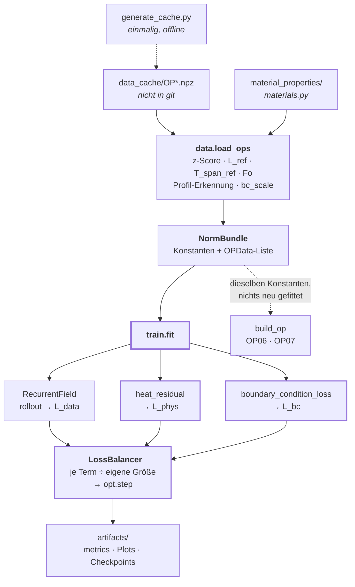
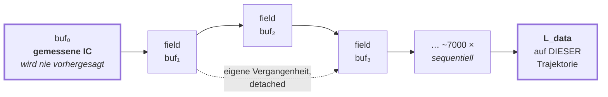
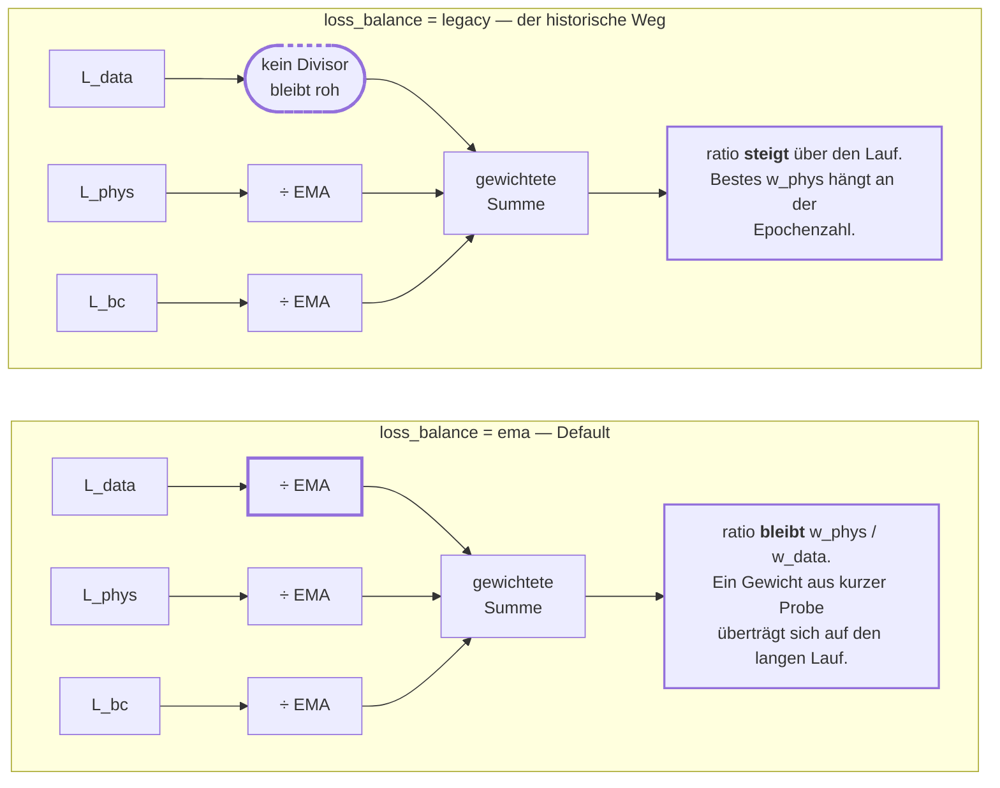

# PINNmodulusTwo — Kontrollfluss und Modell

Wie ein Trainingslauf tatsächlich abläuft, was das Modell ist, und wo man
ansetzt, um es zu erweitern.

| Dokument | Beantwortet |
|---|---|
| [`README.md`](README.md) | *Was* das Projekt ist |
| [`README_GPU_SERVER.md`](README_GPU_SERVER.md) | *Wie* man es auf einem GPU-Server fährt |
| **dieses Dokument** | *Wie* es intern funktioniert |

> **Kurzfassung für Ungeduldige**
> - Das Netz sagt **einen Punkt zu einem Zeitpunkt** vorher. Die Zeit entsteht
>   dadurch, dass es in einer Schleife auf seinen **eigenen Ausgaben** läuft.
> - Kein Teacher Forcing, nirgends. Der Datenverlust wird auf genau der
>   Trajektorie genommen, die auch zur Inferenzzeit entsteht.
> - Die History-Anordnung (`δ`, `k_max`, `Δgrid`, `rate_lags`) ist **fest**.
>   Gelernt werden nur MLP-Gewichte, das Swish-`β` je Schicht und zwei
>   Physik-Gains.
> - ~7000 sequentielle Rollout-Schritte je OP und Epoche sind der Engpass —
>   nicht die Matrixmultiplikationen. Deshalb bringt eine GPU weniger als erwartet.
> - Nach jeder Änderung an der Skalierung: `python3 PINNmodulusTwo/selftest.py`.

**Inhalt**

1. [Die Kette auf einen Blick](#1-die-kette-auf-einen-blick)
2. [Was das Modell ist](#2-was-das-modell-ist)
3. [Der Rollout — kein Teacher Forcing](#3-der-rollout--kein-teacher-forcing)
4. [Das Physik-Residuum](#4-das-physik-residuum)
5. [Die Normierung — Profile gegen Labels](#5-die-normierung--profile-gegen-labels)
6. [Der Trainingsschritt und das Loss-Balancing](#6-der-trainingsschritt-und-das-loss-balancing)
7. [Erweitern — wo man ansetzt](#7-erweitern--wo-man-ansetzt)
8. [Artefakte](#8-artefakte)

---

## 1. Die Kette auf einen Blick



`heat_residual` und `boundary_condition_loss` sind die einzigen Pfade, die
Autograd **zweimal** brauchen (Hesse-Matrix im Raum).

Darüber liegen die Benchmarks. Sie rufen alle dasselbe `train.fit()` auf und
unterscheiden sich nur in der Achse, die sie variieren:

| Skript | Achse | Laufzeit | Wann |
|---|---|---|---|
| `selftest.py` | — reine Arithmetik | Sekunden | vor allem anderen |
| `smallBench.py` | `w_phys`, 2 Werte | 2–5 min | Rauchtest |
| `benchmark_balance.py` | Loss-Skalierung, Eingangskanäle | ~7 h, 2 Sessions | **zuerst** — legt fest, was ein Gewicht bedeutet |
| `benchmark_wphys_wbc.py` | `w_phys` × `w_bc` | ~6 h Probe, Tage fürs Gitter | danach |
| `benchmark_arch.py` | Breite, Tiefe, Lags, `delta_grid` | ~1–1,5 Tage | danach |

Die gemeinsame Maschinerie — pro Seed trainieren, über Seeds mitteln, val/test
trennen, Rausch-Verdikt — liegt in `bench_common.py`. Ein neuer Benchmark
beschreibt nur seine eigene Achse.

---

## 2. Was das Modell ist

`model.RecurrentField` — ein MLP, das **einen Punkt zu einem Zeitpunkt**
vorhersagt. Die Zeitdimension entsteht nicht im Netz.

### 2.1 Eingangsvektor

Alles wird zu einem flachen Vektor konkateniert (`field()`, `model.py:390`):

| Block | Breite | Woher | Bedeutung |
|---|---:|---|---|
| `xn` | 3 | `data.py` | Ortskoordinaten, geteilt durch ein gemeinsames `L_ref` |
| `static` | 3 | `_static_features` | Temperaturleitfähigkeit (z-skaliert), JR1-Indikator, x-Ebene |
| `cfg` | 7 + | `_normalise_config` | Simulations-Configs zum Zeitpunkt `t`, optional deren Raten |
| `forcing` | 1 + | `q_dot(t)` | Wärmequelle, optional die kumulierte Energie |
| `hist` | `k_max` | `_history()` | **die Rekurrenz** |
| | **= 17** | | Standardkonfiguration: hybrid, zwei Rate-Lags |

Ausgang: ein Skalar — die z-skalierte Temperatur `Tn` an diesem Punkt.

### 2.2 Der History-Block

Zwei Layouts, umschaltbar über `history_mode`:

**`raw`** (`_history_raw`, `model.py:372`) — `k_max` Temperaturwerte im Abstand `δ`:

```
[ T(t−δ),  T(t−2δ),  …,  T(t−k·δ) ]
```

**`hybrid`** (`_history_hybrid`, `model.py:308`, Default) — ein Ankerwert plus
Raten über **kumulative** Segmente:

```
             ├──── 20 s ────┤├─ 5 s ─┤├ Δgrid ┤
   ──────────●──────────────●─────────●────────●──────>  Zeit
        T(t−Δgrid−25)  T(t−Δgrid−5)  T(t−Δgrid)   t
                                      ▲
                                    Anker

   Kanal 1 :  T(t−Δgrid)                              (Absolutwert)
   Kanal 2 :  [T(t−Δgrid)   − T(t−Δgrid−5)]  ÷  5     (Rate 1)
   Kanal 3 :  [T(t−Δgrid−5) − T(t−Δgrid−25)] ÷ 20     (Rate 2)
```

`Δgrid` verschiebt, **wo** das Fenster sitzt; es ist kein Teil einer Spanne. Die
Endpunkte von Rate 1 liegen 5 s auseinander, egal wie weit der Anker zurückliegt.
Deshalb sind `--delta-grid` und `--subsample` unabhängige Regler.

> **Fallstrick, der schon einmal alles zerstört hat.** Die Rate wird durch die
> **nominale** Segmentlänge geteilt, nie durch die geklammerte tatsächlich
> verstrichene Spanne. Am Anfang des Rollouts ist die verstrichene Spanne ein
> einziger Gitterschritt (`dtn ≈ 1.4e-4` normiert bei Δt = 0.2 s); die Division
> dadurch verstärkt die Ein-Schritt-Differenz um ~7000×, füttert sie zurück ins
> Netz, und der Rollout läuft binnen weniger Schritte nach `inf → nan`.
> (`model.py:332`)

Lookups zwischen zwei Gitterpunkten werden linear interpoliert
(`interp_history`, `model.py:127`), ein Lag darf also zwischen Samples liegen.
Vor `t = 0` gilt `T(t) := T(0)` (`_padded_lookup`).

### 2.3 Was gelernt wird und was nicht

| | Was | Warum |
|---|---|---|
| **Gelernt** | MLP-Gewichte · `β` je Schicht im Swish `x·σ(βx)` · `src_gain` / `diff_gain` | die Gains korrigieren einen Skalenunterschied zwischen Quell- und Diffusionsterm; sie laufen mit `gain_lr_mult`-facher LR, sonst bleiben sie bei ihrer 1.0-Initialisierung stehen |
| **Fest** | `δ` · `k_max` · `Δgrid` · `rate_lags` · Lag-Gates | als **Buffer** registriert, nicht als Parameter. Die History-Anordnung wird einmal konfiguriert und mit `benchmark_arch.py` gesweept, statt zu hoffen, dass das Netz sie findet |

`gates()` gibt konstant Einsen zurück — es gibt kein Lag-Gating mehr. Die Methode
existiert nur noch, damit Log, `metrics.txt` und Checkpoints eine stabile Form
behalten.

> **Warum nicht lernbar.** Eine frühere Version machte `rate_lags` lernbar und
> schickte sie durch `softplus`. Für die winzigen normierten Werte gilt
> `softplus(x) ≈ x` nicht — aus einem angeforderten 5-s-Lag wurden still 1024 s.
> (`model.py:207`)

<details>
<summary>Woher Modulus kommt und was PyTorch ist (die ~50:50-Aufteilung)</summary>

| Modulus | PyTorch |
|---|---|
| `modulus.models.module.Module` — Save/Load, Device, Meta | lernbarer Swish `x·σ(βx)`, ein `β` pro Schicht |
| `modulus.models.layers.FCLayer` — Weight-Norm-Blöcke | die Rekurrenz: raw oder hybrid |
| MLP als Funktionsapproximator für das Feld | differenzierbare Zeitinterpolation, damit ein Lag zwischen zwei Gitterpunkten liegen darf |
| — | Physik: Autograd-Hesse im Raum + finite Differenz in der Zeit |

Das ist Methode 2 aus der Notion-Seite: Modulus als Werkzeug benutzen, aber die
Rekurrenz selbst mitbringen.

</details>

---

## 3. Der Rollout — kein Teacher Forcing

`rollout()` (`model.py`) erzeugt die Trajektorie. Der gradientenführende
Zwilling `rollout_train()` ist entfallen: er hat die History zwischen den
Schritten ohnehin detached, der Gradient bei `t` verließ also nie die eigene
Feldauswertung dieses Schritts — ~7000 sequentielle Schritte für **einen**
Optimierer-Schritt. Trainiert wird jetzt gegen die eingefrorene Trajektorie
(siehe Abschnitt 6):

```python
buf[0] = Tn_ic                                              # die GEMESSENE IC
for ti in range(1, n_t):
    hist    = model._history(buf[:ti], dtn, tn[ti], p_idx)  # eigene Vergangenheit
    buf[ti] = model.field(xn, static, cfg_seq[ti], forcing_seq[ti], hist)
```



Drei Konsequenzen, die man kennen muss:

1. **Der Datenverlust wird auf der eigenen Trajektorie genommen.** Nie auf
   Ground-Truth-History. Was im Training gemessen wird, ist genau das, was zur
   Inferenzzeit passiert — inklusive Fehlerakkumulation.
2. **Die Anfangsbedingung wird auferlegt, nicht gelernt.** `buf[0]` ist die
   Messung, und die History liest nur aus *strikt früheren*, bereits berechneten
   Zeiten. `t = 0` wird nie vorhergesagt.
3. **Truncated BPTT.** `buf[:ti].detach()` — jeder Schritt propagiert nur durch
   seine eigene Feldauswertung. Der Speicher bleibt beschränkt, aber es fließt
   kein Gradient entlang der Zeitachse.

> **Hier geht die Zeit hin.** ~7000 sequentielle Schritte pro OP und Epoche, die
> sich prinzipiell nicht parallelisieren lassen — jeder braucht den vorherigen.
> Deshalb bringt eine GPU hier viel weniger als erwartet, und deshalb spart das
> Überspringen der Nullgewichts-Terme **gemessen nur ~3 %**. Größere Batches
> helfen nur dem Physik-Term.

---

## 4. Das Physik-Residuum

`physics.heat_residual` (`physics.py:82`). Anisotrope Wärmeleitung, dimensionslos:

```
∂T/∂t  −  ∇·(Fo ∇T)  −  Q_src  =  0
   │           │            │
   │           │            └─  src_gain  · Qsrc / Qsrc_scale
   │           └──────────────  diff_gain · aniso / aniso_scale
   └──────────────────────────  dTdt / dTdt_scale      (kein Gain!)
```

| Teil | Methode | Detail |
|---|---|---|
| **Raum** | Autograd, zweimal | `grad1 = ∂T/∂x`, dann drei weitere `grad`-Aufrufe für die Hesse-Zeilen. Alle sechs unabhängigen Komponenten des anisotropen Tensors gehen ein |
| **Zeit** | finite Differenz über die Rekurrenz | `bdf1`, `bdf2` (Default), `autograd`. Der BDF-Stencil liest über `history_at()` mit dem festen `δ` — **nicht** über das Hybrid-Layout |
| **Skalierung** | jeder Term ÷ eigener Trainings-RMS | landet bei Einheitsskala, *bevor* die lernbaren Gains ihn anfassen |

> **Warum `/scale` und nicht `/sqrt(scale)`.** Die `*_scale`-Konstanten in
> `data.py` sind bereits RMS-Werte, also gibt `x / scale` genau
> `mean(res²) = 1`. Der ursprüngliche Code teilte durch `sqrt(scale)` und ließ
> `mean(res²) = scale` stehen — die drei Terme behielten damit genau den
> Größenabstand, den die Skalen beseitigen sollten. `src_gain`/`diff_gain`
> konnten das teilweise auffangen; **`dTdt` hat gar keinen Gain.**
> `--residual-norm legacy` hält den alten Pfad für Vergleiche offen.

> **Folge für `--phys-norm`.** Der Wert wirkt jetzt auf ein anders skaliertes
> `L_phys` — im `rms`-Modus entfällt die äußere Division durch `phys_scale`. Ein
> unter der alten Skalierung eingestellter fester Divisor ist **nicht**
> übertragbar.

`boundary_condition_loss` (`physics.py:36`) erzwingt `∂T/∂x = 0` in der
Symmetrieebene `x = 0`. Der Maßstab ist der **gemessene** RMS-Ortsgradient über
x-benachbarte Gitterpunkte (`data._measure_bc_scale`), nicht mehr das frühere
`1/L_ref`, in dem gar keine Temperatur vorkam.

---

## 5. Die Normierung — Profile gegen Labels

Alles wird auf Trainingsdaten gefittet und in `NormBundle` abgelegt. Ein
gehaltenes OP läuft über `build_op()` durch **exakt dieselben** Konstanten —
nichts wird neu gefittet, sonst wäre es kein echter Out-of-Sample-Test.

| Konstante | Bedeutung |
|---|---|
| `T_mu`, `T_sigma` | gepoolter z-Score der Temperatur über alle Trainings-OPs und -Zeiten |
| `L_ref` | geometrisches Mittel der Achsenausdehnungen — ein gemeinsamer Ortsmaßstab |
| `T_span_ref` | längste Trajektorie; skaliert `t` auf `tn ∈ [0,1]` |
| `Fo` | `λ · T_span_ref / (ρ Cp L_ref²)` — Fourier-Tensor je Punkt |
| `dTdt_scale`, `aniso_scale`, `Qsrc_scale` | RMS je Residuenterm |
| `bc_scale` | gemessener RMS-Ortsgradient |
| `q_mu`, `q_sigma` | Normierung der Wärmequelle |
| `config_mu`, `config_sigma` | z-Score der Config-Kanäle |

### 5.1 Der Unterschied, der über Generalisierung entscheidet

`load_ops()` teilt die Config-Kanäle in zwei Sorten. `train.py` gibt beides beim
Start aus, direkt unter der `OPs=`-Zeile:

```
  config profiles (vary in time) : ['c_rate', 'cell_current', 'fluid_inlet_temp']
  config labels (constant per OP): ['fluid_initial_temp', 'fluid_mass_flow', ...]
```

| Sorte | Verhalten | Konsequenz |
|---|---|---|
| **Profil** | ändert sich *innerhalb* eines OP über die Zeit | echter Zeitverlauf — genau dafür ist die Rekurrenz da |
| **Label** | je OP konstant, unterscheidet sich zwischen OPs | eine Konstante, die das Netz **pro OP auswendig lernen** kann |

Bei fünf Trainings-OPs können ein paar Label-Kanäle zusammen als **OP-Kennung**
wirken, und ein daran gelernter Offset überträgt sich nicht auf OP06/OP07. Wenn
die Held-out-MAE deutlich über der Train-MAE liegt, ist das ein Kandidat für die
Ursache.

Das ist zugleich die Begründung für die ganze Rekurrenz: zwei OPs können zum
Zeitpunkt `t` dieselbe momentane Config haben und trotzdem völlig verschiedene
Temperaturen, weil ihre *Vorgeschichte* verschieden war.

---

## 6. Der Trainingsschritt und das Loss-Balancing

```python
für jede Epoche:
  für jedes OP:
    with no_grad:
      buf    = rollout(...)                      # <- ~7000 sequentielle Schritte,
                                                 #    EINMAL pro OP und Epoche
    für inner_steps Schritte:                    # <- hier schrittet der Optimierer
      L_data = mean((field(minibatch) − Tn[…])²) #    batch_data (t, Punkt)-Paare
      L_phys = mean(heat_residual(...)²)         #    batch_phys Stichproben
      L_bc   = mean(boundary_condition_loss(...)²)

      L_*_bal  = L_* / balance.divisor(...)      #    je Term durch eigene Größe
      loss     = w_data·L_data_bal + w_phys·L_phys_bal + w_bc·L_bc_bal

      loss.backward();  clip_grad_norm_;  opt.step()
```

Alle `inner_steps` Updates laufen gegen dieselbe eingefrorene Trajektorie. Das
ist genau der Gradient, den der alte differenzierbare Rollout auch geliefert hat
— nur zahlt eine Trajektorie jetzt `inner_steps` Updates statt einem. Bei fünf
OPs und `inner_steps: 100` sind das **500 Optimierer-Schritte je Epoche** statt
fünf; vorher war ein 60-Epochen-Lauf nach 300 Adam-Updates fertig, was für ein
70k-Parameter-MLP viel zu wenig ist.

Der Preis des Einfrierens: nach einigen Updates ist der Puffer nicht mehr ganz
die Trajektorie, die die aktuellen Gewichte erzeugen würden. Er wird jede Epoche
erneuert — `inner_steps` tauscht also Update-Anzahl gegen Aktualität der
Trajektorie. Hunderte sind richtig, Zehntausende nicht.

Das zweite OP sieht dabei bereits die Gewichte, die das erste aktualisiert hat —
die OP-Reihenfolge ist hier die Listenreihenfolge aus `ops` und wird nicht
gemischt. (Die Profil-Erweiterung mischt sie, weil ihre OPs über 0 C bis 4 C
weit heterogener sind; siehe `PINNmodulusTwoExtProfiles/README.md`.)

### 6.1 Warum überhaupt balanciert wird

Die drei Terme leben auf völlig verschiedenen Skalen; ein rohes Gewicht ist darum
kein Mischungsverhältnis. Jeder Term wird durch eine laufende Schätzung seiner
eigenen Größe geteilt — **welche** Terme, entscheidet `--loss-balance`:

> Der Default `ema` teilt auch `L_data`. Damit bedeutet ein `w_phys` etwas
> anderes als unter dem alten Schema, in dem `L_data` roh blieb — ältere
> Gewichts-Ergebnisse sind nicht direkt vergleichbar. Was das genau heißt und
> wie man das alte Schema reproduziert, steht in
> [README.md](README.md#loss-balancing-and-what-it-does-to-older-numbers).



Der Unterschied ist **ein einziger Divisor**. Unter `legacy` passiert `L_data`
ungeteilt und fällt über den Lauf um Größenordnungen, während die beiden
normierten Terme bei ~1 festhängen — die Mischung wandert stetig zur Physik.

| Modus | geteilt werden | Folge |
|---|---|---|
| `ema` *(Default)* | alle drei | `w_data:w_phys:w_bc` ist ein echtes Verhältnis, in Epoche 1 wie in Epoche 60 |
| `legacy` | nur `L_phys`, `L_bc` | die Mischung driftet zur Physik; das beste `w_phys` hängt an `--epochs` |
| `fixed` | alle drei, nach Warm-up eingefroren | deterministisch, keine Rückkopplung zwischen Loss und eigener Skala |

Mitgeloggt wird je Epoche

```
ratio_phys = w_phys · L_phys_bal  ÷  (w_data · L_data_bal)
```

— die Mischung, die der Optimierer **tatsächlich** gesehen hat. Genau darauf
sieht `benchmark_balance.py`.

### 6.2 Drei Details, die keine Kleinigkeiten sind

- **Geteilt wird durch die Schätzung von *vorher*.** Fließt der aktuelle Wert
  zuerst in den Mittelwert ein, dämpft ein Ausschlag sich selbst — ein
  10×-Sprung meldet sich als ~5×. Genau das Signal, das man sehen will.
- **`decay · nan = nan`**, deshalb aktualisiert nur ein endlicher Wert den
  Mittelwert. Sonst hinge der Divisor für den Rest des Laufs auf `nan`.
- **Der Horizont ist in Epochen definiert, nicht in Schritten.** Weil der
  Optimierer *pro OP* schrittet, wäre ein reiner Schritt-Decay bei 5 OPs
  ~2 Epochen und bei einem OP ~10 — Läufe mit verschiedenen `--ops` wären nicht
  vergleichbar. Korrigiert mit `decay^(1/n_ops)`.

<details>
<summary>Terme mit Gewicht 0 — warum <code>if</code> und nicht <code>* 0.0</code></summary>

```python
# 0.0 * nan ist nan. Ein Nullgewicht neutralisiert einen nicht-endlichen
# Term also NICHT -- es vergiftet den ganzen Loss, die Gradienten und jede
# spaetere Epoche. Genau das liess frueher sogar den w_phys=0-Punkt des
# Sweeps L_data=nan melden.
loss = args.w_data * L_data_bal
if args.w_phys != 0.0:
    loss = loss + args.w_phys * L_phys_bal
```

Zusätzlich wird ein Term mit Gewicht 0 gar nicht erst **berechnet**
(`--zero-weight-terms skip`) — er kostet einen Autograd-Hessian und trägt nichts
bei. Protokolliert wird er als `NaN`, damit ein Plot eine Lücke zeigt statt einer
flachen Linie, die es nie gab. Mit `--zero-weight-terms compute` wird er zum
Mitloggen weiter gerechnet.

Gemessene Ersparnis: **~3 %**. Der Rollout dominiert, nicht das Residuum.

</details>

---

## 7. Erweitern — wo man ansetzt

| Vorhaben | Ort | Zu beachten |
|---|---|---|
| Neuer Eingangskanal | `data._assemble_op` + `NormBundle` | `n_config`/`n_forcing` mitziehen, Konstanten aus dem Bundle an `build_op` durchreichen — sonst ist der Held-out-Test verfälscht |
| Neues History-Layout | `model._history_*` + `history_mode` | `k_max` folgt dem Layout; `history_at()` für die Physik getrennt halten |
| Anderer Zeitableiter | `physics.heat_residual`, `time_deriv` | BDF-Stencils lesen über `δ`, nicht über `Δgrid` |
| Weiterer Loss-Term | `train.fit` + `_LossBalancer.KEYS` | einen Divisor spendieren, sonst ist sein Gewicht wieder skalenabhängig |
| Neue Sweep-Achse | neues `benchmark_*.py` | `bench_common.train_one_seed` benutzen; die Achse ist Daten, kein Code |
| **Neues Trainings-Flag** | `train.parse_args` **und** `bench_common.make_train_args` **und** `smallBench._make_args` | `fit()` liest per `getattr` — ein vergessenes Feld **wirft nicht**, es fällt still auf einen anderen Default zurück |

> **Die häufigste Falle in diesem Projekt** ist die letzte Zeile, und sie hat
> schon einmal zugeschlagen: `smallBench` reichte `delta_grid` nicht durch, und
> der Rauchtest lief still mit dem Datenschritt statt dem konfigurierten Anker —
> bei `subsample=2` zufällig identisch, bei jedem anderen Wert nicht.
> (`smallBench.py:114`)

### 7.1 Checkliste vor dem Commit einer Änderung

- [ ] `python3 PINNmodulusTwo/selftest.py` grün (Sekunden, ohne Daten, ohne GPU)
- [ ] neues Flag in **allen drei** Arg-Buildern gesetzt (siehe Tabelle oben)
- [ ] neue Bundle-Konstante auch in `build_op()` durchgereicht
- [ ] wenn die Skalierung berührt wurde: gehört sie in die Benchmark-Signatur?
      (`_probe_signature`, `_merge_parts`) — sonst mischen zwei Sessions still
      Unvergleichbares
- [ ] `python3 PINNmodulusTwo/smallBench.py --epochs 5 --device cuda` endet mit
      `✓ ALL CHECKS PASSED`

> **Warum ein Selbsttest.** Die Eigenschaften, die er prüft — eine vergiftete
> EMA, ein Divisor dessen Horizont an der OP-Zahl hängt, eine „Normierung", die
> nicht normiert — sind in einem Trainingslog **unsichtbar**. Sie sehen aus wie
> ein Lauf, der halt schlecht konvergiert ist. Die nächste Gelegenheit, sie zu
> bemerken, ist ein mehrstündiger Benchmark.

---

## 8. Artefakte

Alles landet in `PINNmodulusTwo/artifacts/` (nicht in git):

| Datei | Von wem |
|---|---|
| `metrics.txt`, `training_curves.png`, `timeseries.png`, `pred_OP0*.npz` | `train.py` |
| `smallBench_results.txt`, `smallBench_convergence.png` | `smallBench.py` |
| `benchmark_balance.csv`, `_best.txt`, `.png`, `_ratio.png`, `balance_parts.json` | `benchmark_balance.py` |
| `benchmark_wphys_wbc.csv`, `_best.txt`, `_settings.txt`, `probe_parts.json` | `benchmark_wphys_wbc.py` |
| `benchmark_arch.csv`, `_best.txt`, `.png` | `benchmark_arch.py` |

Die `*_parts.json` tragen eine **Signatur** aller Einstellungen, die einen Lauf
prägen — das Balancing eingeschlossen. Läuft ein zweiter Teil mit anderen
Einstellungen, wird der gespeicherte **verworfen** statt still dazugemischt:

```
  [probe] stored part(s) ran with different settings - discarding them;
  the other part has to be re-run to match this one.
```

Das ist Absicht. Ein halbes Kreuz aus zwei verschiedenen Experimenten sähe wie
ein Ergebnis aus, und nichts im Output würde es verraten.
