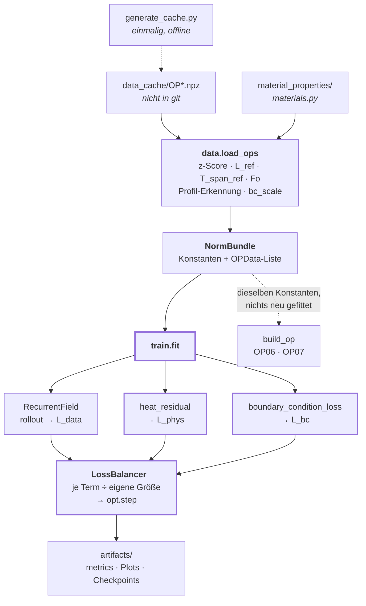
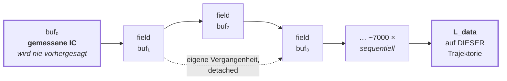

# PINNmodulusTwo — Kontrollfluss und Modell

Wie ein Trainingslauf tatsächlich abläuft, was das Modell ist, und wo man
ansetzt, um es zu erweitern.

| Dokument | Beantwortet |
|---|---|
| [`README.md`](README.md) | *Was* das Projekt ist |
| [`README_GPU_SERVER.md`](README_GPU_SERVER.md) | *Wie* man es auf einem GPU-Server fährt |
| **dieses Dokument** | *Wie* es intern funktioniert |

> **Kurzfassung für Ungeduldige**
> - Das Netz sagt **einen Punkt zu einem Zeitpunkt** vorher. Die Zeit entsteht
>   dadurch, dass es in einer Schleife auf seinen **eigenen Ausgaben** läuft.
> - Kein Teacher Forcing, nirgends. Der Datenverlust wird auf genau der
>   Trajektorie genommen, die auch zur Inferenzzeit entsteht.
> - `residual_output` ist **aus** und `rate_lags` sind **lang**. Beides ist
>   nicht optional: mit den alten Werten bricht jeder Lauf in Epoche 1 mit
>   `L_data = nan` ab — siehe Abschnitt 3.1.
> - Die History-Anordnung (`δ`, `k_max`, `Δgrid`, `rate_lags`) ist **fest**.
>   Gelernt werden nur MLP-Gewichte, das Swish-`β` je Schicht und zwei
>   Physik-Gains.
> - ~7000 sequentielle Rollout-Schritte je OP und Epoche sind der Engpass —
>   nicht die Matrixmultiplikationen. Deshalb bringt eine GPU weniger als erwartet.
> - Nach jeder Änderung an der Skalierung: `python3 PINNmodulusTwo/selftest.py`.

**Inhalt**

1. [Die Kette auf einen Blick](#1-die-kette-auf-einen-blick)
2. [Was das Modell ist](#2-was-das-modell-ist)
3. [Der Rollout — kein Teacher Forcing](#3-der-rollout--kein-teacher-forcing)
4. [Das Physik-Residuum](#4-das-physik-residuum)
5. [Die Normierung — Profile gegen Labels](#5-die-normierung--profile-gegen-labels)
6. [Der Trainingsschritt und das Loss-Balancing](#6-der-trainingsschritt-und-das-loss-balancing)
7. [Erweitern — wo man ansetzt](#7-erweitern--wo-man-ansetzt)
8. [Artefakte](#8-artefakte)

---

## 1. Die Kette auf einen Blick



`heat_residual` und `boundary_condition_loss` sind die einzigen Pfade, die
Autograd **zweimal** brauchen (Hesse-Matrix im Raum).

Darüber liegen die Benchmarks. Sie rufen alle dasselbe `train.fit()` auf und
unterscheiden sich nur in der Achse, die sie variieren:

| Skript | Achse | Laufzeit | Wann |
|---|---|---|---|
| `selftest.py` | — reine Arithmetik | Sekunden | vor allem anderen |
| `smallBench.py` | `w_phys`, 2 Werte | 2–5 min | Rauchtest |
| `benchmark_balance.py` | Loss-Skalierung, Eingangskanäle | ~7 h, 2 Sessions | **zuerst** — legt fest, was ein Gewicht bedeutet |
| `benchmark_wphys_wbc.py` | `w_phys` × `w_bc` | ~6 h Probe, Tage fürs Gitter | danach |
| `benchmark_arch.py` | Breite, Tiefe, Lags, `delta_grid` | ~1–1,5 Tage | danach |

Die gemeinsame Maschinerie — pro Seed trainieren, über Seeds mitteln, val/test
trennen, Rausch-Verdikt — liegt in `bench_common.py`. Ein neuer Benchmark
beschreibt nur seine eigene Achse.

---

## 2. Was das Modell ist

`model.RecurrentField` — ein MLP, das **einen Punkt zu einem Zeitpunkt**
vorhersagt. Die Zeitdimension entsteht nicht im Netz.

### 2.1 Eingangsvektor

Alles wird zu einem flachen Vektor konkateniert (`field()`, `model.py:390`):

| Block | Breite | Woher | Bedeutung |
|---|---:|---|---|
| `xn` | 3 | `data.py` | Ortskoordinaten, geteilt durch ein gemeinsames `L_ref` |
| `static` | 3 | `_static_features` | Temperaturleitfähigkeit (z-skaliert), JR1-Indikator, x-Ebene |
| `cfg` | 7 + | `_normalise_config` | Simulations-Configs zum Zeitpunkt `t`, optional deren Raten |
| `forcing` | 1 + | `q_dot(t)` | Wärmequelle, optional die kumulierte Energie |
| `hist` | `k_max` | `_history()` | **die Rekurrenz** |
| | **= 17** | | Standardkonfiguration: hybrid, zwei Rate-Lags |

Ausgang: ein Skalar — die z-skalierte Temperatur `Tn` an diesem Punkt.

### 2.2 Der History-Block

Zwei Layouts, umschaltbar über `history_mode`:

**`raw`** (`_history_raw`, `model.py:372`) — `k_max` Temperaturwerte im Abstand `δ`:

```
[ T(t−δ),  T(t−2δ),  …,  T(t−k·δ) ]
```

**`hybrid`** (`_history_hybrid`, `model.py:308`, Default) — ein Ankerwert plus
Raten über **kumulative** Segmente:

```
            ├───── 600 s ─────┤├── 200 s ──┤├ Δgrid ┤
   ─────────●─────────────────●─────────────●────────●──────>  Zeit
       T(t−Δgrid−800)   T(t−Δgrid−200)  T(t−Δgrid)     t
                                            ▲
                                          Anker

   Kanal 1 :  T(t−Δgrid)                                   (Absolutwert)
   Kanal 2 :  [T(t−Δgrid)     − T(t−Δgrid−200)] ÷ 200      (Rate 1)
   Kanal 3 :  [T(t−Δgrid−200) − T(t−Δgrid−800)] ÷ 600      (Rate 2)
```

> **Warum 200 und 600 und nicht 5 und 20.** Der Divisor ist `lag_n · rate_scale`,
> und für ein glattes Signal ist das genau der RMS der Differenz über dieses
> Segment. Der Kanal verstärkt damit alles Nicht-Glatte um
> `A = 1/(lag_n · rate_scale)`. Bei 5 s auf einer ~1474-s-Spanne ist `A ≈ 119`
> und der Rollout divergiert; bei 200 s ist `A ≈ 3`. Siehe Abschnitt 3.1.

`Δgrid` verschiebt, **wo** das Fenster sitzt; es ist kein Teil einer Spanne. Die
Endpunkte von Rate 1 liegen 200 s auseinander, egal wie weit der Anker zurückliegt.
Deshalb sind `--delta-grid` und `--subsample` unabhängige Regler.

> **Fallstrick, der schon einmal alles zerstört hat.** Die Rate wird durch die
> **nominale** Segmentlänge geteilt, nie durch die geklammerte tatsächlich
> verstrichene Spanne. Am Anfang des Rollouts ist die verstrichene Spanne ein
> einziger Gitterschritt (`dtn ≈ 1.4e-4` normiert bei Δt = 0.2 s); die Division
> dadurch verstärkt die Ein-Schritt-Differenz um ~7000×, füttert sie zurück ins
> Netz, und der Rollout läuft binnen weniger Schritte nach `inf → nan`.
> (`model.py:332`)

Lookups zwischen zwei Gitterpunkten werden linear interpoliert
(`interp_history`, `model.py:127`), ein Lag darf also zwischen Samples liegen.
Vor `t = 0` gilt `T(t) := T(0)` (`_padded_lookup`).

### 2.3 Was gelernt wird und was nicht

| | Was | Warum |
|---|---|---|
| **Gelernt** | MLP-Gewichte · `β` je Schicht im Swish `x·σ(βx)` · `src_gain` / `diff_gain` | die Gains korrigieren einen Skalenunterschied zwischen Quell- und Diffusionsterm; sie laufen mit `gain_lr_mult`-facher LR, sonst bleiben sie bei ihrer 1.0-Initialisierung stehen |
| **Fest** | `δ` · `k_max` · `Δgrid` · `rate_lags` · Lag-Gates | als **Buffer** registriert, nicht als Parameter. Die History-Anordnung wird einmal konfiguriert und mit `benchmark_arch.py` gesweept, statt zu hoffen, dass das Netz sie findet |

`gates()` gibt konstant Einsen zurück — es gibt kein Lag-Gating mehr. Die Methode
existiert nur noch, damit Log, `metrics.txt` und Checkpoints eine stabile Form
behalten.

> **Warum nicht lernbar.** Eine frühere Version machte `rate_lags` lernbar und
> schickte sie durch `softplus`. Für die winzigen normierten Werte gilt
> `softplus(x) ≈ x` nicht — aus einem angeforderten 5-s-Lag wurden still 1024 s.
> (`model.py:207`)

<details>
<summary>Woher Modulus kommt und was PyTorch ist (die ~50:50-Aufteilung)</summary>

| Modulus | PyTorch |
|---|---|
| `modulus.models.module.Module` — Save/Load, Device, Meta | lernbarer Swish `x·σ(βx)`, ein `β` pro Schicht |
| `modulus.models.layers.FCLayer` — Weight-Norm-Blöcke | die Rekurrenz: raw oder hybrid |
| MLP als Funktionsapproximator für das Feld | differenzierbare Zeitinterpolation, damit ein Lag zwischen zwei Gitterpunkten liegen darf |
| — | Physik: Autograd-Hesse im Raum + finite Differenz in der Zeit |

Das ist Methode 2 aus der Notion-Seite: Modulus als Werkzeug benutzen, aber die
Rekurrenz selbst mitbringen.

</details>

---

## 3. Der Rollout — kein Teacher Forcing

`rollout()` (`model.py`) erzeugt die Trajektorie. Der gradientenführende
Zwilling `rollout_train()` ist entfallen: er hat die History zwischen den
Schritten ohnehin detached, der Gradient bei `t` verließ also nie die eigene
Feldauswertung dieses Schritts — ~7000 sequentielle Schritte für **einen**
Optimierer-Schritt. Trainiert wird jetzt gegen die eingefrorene Trajektorie
(siehe Abschnitt 6):

```python
buf[0] = Tn_ic                                              # die GEMESSENE IC
for ti in range(1, n_t):
    hist    = model._history(buf[:ti], dtn, tn[ti], p_idx)  # eigene Vergangenheit
    buf[ti] = model.field(xn, static, cfg_seq[ti], forcing_seq[ti], hist)
```



Drei Konsequenzen, die man kennen muss:

1. **Der Datenverlust wird auf der eigenen Trajektorie genommen.** Nie auf
   Ground-Truth-History. Was im Training gemessen wird, ist genau das, was zur
   Inferenzzeit passiert — inklusive Fehlerakkumulation.
2. **Die Anfangsbedingung wird auferlegt, nicht gelernt.** `buf[0]` ist die
   Messung, und die History liest nur aus *strikt früheren*, bereits berechneten
   Zeiten. `t = 0` wird nie vorhergesagt.
3. **Truncated BPTT.** `buf[:ti].detach()` — jeder Schritt propagiert nur durch
   seine eigene Feldauswertung. Der Speicher bleibt beschränkt, aber es fließt
   kein Gradient entlang der Zeitachse.

### 3.1 Warum der Rollout divergiert ist — und was daran schuld war

Bis zu diesem Befund brach jeder Lauf in Epoche 1 mit `L_data = nan` ab. Der
strukturelle Grund, warum das terminal ist: der Trainingsloop (Abschnitt 6)
rechnet **einen** Rollout je OP und Epoche unter `no_grad` und macht dann
`--inner-steps` Updates gegen diesen eingefrorenen Puffer. Der Puffer ist damit
ein **Eingang** des ersten Gradientenschritts, kein Ergebnis davon. Steht dort
`inf`, ist jede Vorhersage `nan`, und es gibt keinen ersten Gradientenschritt,
aus dem heraus es besser werden könnte.

Zwei Dinge haben ihn dorthin gebracht, und sie sind **nicht gleich wichtig**.

#### Der Haupttreiber: `residual_output`

`field()` lieferte `level(t) + net(...)`, wobei `level` das räumliche Mittel der
Ankerscheibe ist. Die Begründung im Docstring lautete, das Mitführen des Niveaus
halte den Rollout vom Driften ab. Es tut das Gegenteil:

```
level(t) ≈ level(t - Δgrid) + mean(net)
```

Das ist ein **Integrator mit Verstärkung exakt 1 und ohne Leck**. Jeder
einseitige Anteil der Netzausgabe akkumuliert über die ~7000 Schritte
unbeschränkt, und nichts zieht ihn zurück. Wie *klein* dieser Anteil ist, spielt
keine Rolle — ein Integrator interessiert sich nur dafür, dass er ein Vorzeichen
hat. Bei zufälliger Initialisierung hat er eines: Swish ist nicht
mittelwertfrei, also mittelt sich `mean(net)` über eine Ziehung nicht weg.

#### Der Nebentreiber: zu kurze `rate_lags`

Der Rate-Kanal ist `(T_ende - T_start) / (lag_n · rate_scale)`. Für eine *echte*
Rate ist das die richtige Normierung — `rate_scale` ist der RMS von `dTn/dtn`,
der Kanal landet bei O(1). Was niemand geprüft hat, ist die
**Rauschverstärkung** derselben Formel:

```
A = 1 / (lag_n · rate_scale)
```

Bei den alten `[5, 20]` s ist `A ≈ 119`, weil 5 s nur 0.34 % der ~1474 s
Referenzspanne sind. Jede Nicht-Glattheit — insbesondere das Schritt-zu-Schritt-
Zittern eines untrainierten Netzes — kommt 119-fach verstärkt zurück in den
Eingang. `A` wird bei jedem Start ausgegeben und ab ~100 gewarnt.

#### Die Messung

Synthetisches Bundle, 20 Epochen, 3 Seeds, **ohne jedes Hilfsmittel** (kein
Clamp, nichts). Angegeben ist das free-running `L_data` der letzten Epochen:

| `residual_output` | History | Seed 0 | Seed 1 | Seed 2 |
|---|---|---|---|---|
| **true** | hybrid `[5, 20]` | ABORT | ABORT | ABORT |
| **true** | hybrid `[200, 600]` | ABORT | ABORT | ABORT |
| **true** | raw | ABORT | ABORT | ABORT |
| false | hybrid `[5, 20]` | 0.0148 | ABORT | 0.0061 |
| false | raw | 0.0074 | 0.0073 | 0.0069 |
| false | **hybrid `[200, 600]`** | **3.3e-4** | **9.8e-5** | **7.2e-5** |

`residual_output: true` bricht **9/9 ab, in jeder History-Konfiguration** — auch
bei `raw`, wo es überhaupt keine Rate-Kanäle gibt. Das ist der Beweis, dass der
Integrator und nicht die Verstärkung der Haupttreiber ist. Bestätigt bei
`n_t = 4000` (3.3× längere Trajektorie): alt 3/3 ABORT, neu 3/3 bei ~1e-4.

Daraus die beiden Defaults in `config.yaml`: `residual_output: false` und
`rate_lags: [200.0, 600.0]`. Beides sind **Layout-Entscheidungen, keine
Krücken** — und die neue Kombination ist nicht bloß stabiler, sie ist zwei
Größenordnungen besser.

#### Mit aktivem Physik-Term

Die Tabelle oben lief mit `w_phys = 0`. Die Produktivkonfiguration hat
`w_phys: 0.1`, und das verschiebt die Grenze spürbar — der Physik-Gradient
treibt die Gewichte schneller aus dem stabilen Bereich. Gleiches Bundle,
20 Epochen, 3 Seeds, `w_phys = 0.1`:

| Konfiguration | ohne `rollout_clamp` | mit `rollout_clamp: 50` |
|---|---|---|
| `residual_output: true`, `[5,20]`, 64/3 | ABORT \| 2.9e6 \| ABORT | — |
| `residual_output: false`, `[200,600]`, 64/3 | 0.0044 \| 0.0329 \| 0.0019 | — |
| `residual_output: false`, `[200,600]`, **128/4** | **ABORT** \| 0.0023 \| 0.0076 | **0.0156 \| 5.9e-4 \| 0.0135** |
| `residual_output: false`, **raw**, 64/3 | **ABORT \| ABORT** \| 0.0148 | **0.0134 \| 0.0095 \| 0.0148** |

Zwei Dinge, die man ohne diesen Durchgang nicht gesehen hätte:

1. **`residual_output: false` ist notwendig, aber nicht hinreichend.** Bei
   Produktivbreite 128/4 bricht auch die gute Konfiguration auf einem von drei
   Seeds ab, und `raw` — ohne Physik noch 3/3 sauber — bricht auf zweien ab.
2. **`rollout_clamp` ist damit tragend, nicht bloß Diagnose.** Er verwandelt
   beide Fälle in 3/3 konvergierende Läufe. Ohne Physik-Term wäre er nur ein
   Logging-Hilfsmittel gewesen; das war die Fehleinschätzung, solange nur mit
   `w_phys = 0` gemessen wurde.

#### Ist das Ergebnis am Ende brauchbar? (MAE, nicht `L_data`)

`L_data` ist ein z-normierter Trainingsverlust auf dem Trainingsabschnitt. Die
Lieferzahl ist MAE in °C auf dem gehaltenen Teil. Die beiden ordnen die
Konfigurationen **nicht gleich**, und das ist kein Detail.

128/4, `w_phys = 0.1`, `rollout_clamp: 50`, 12 Epochen, 3 Seeds:

| | MAE train [°C] | MAE test [°C] | Mittel test |
|---|---|---|---|
| `hybrid [200,600]` | 0.72 / 0.24 / 0.44 | 0.81 / 0.38 / **2.43** | 1.21 |
| `raw` | 0.81 / 0.36 / 0.36 | **1.70** / 0.77 / 0.43 | 0.97 |
| Baseline: IC festhalten | 5.36 | 11.96 | |
| Baseline: Mittelwert der Trainingslabels | 2.69 | 6.60 | |

**Das Modell ist brauchbar**: 0.4–2.4 °C gegen 6.6–12 °C für die trivialen
Baselines, Faktor 3–17.

**Aber der `L_data`-Vorsprung von `[200,600]` überträgt sich nicht.** Auf
`L_data` lag es 100× vor `raw`; auf MAE_test liegt `raw` im Mittel leicht vorn,
und der Abstand ist kleiner als die Streuung über die Seeds. Erklärung: ein
600-s-Fenster auf einer 1474-s-Trajektorie ist weniger eine Rate als ein
Fortschrittsindikator. In-sample ist das extrem informativ, jenseits von
`split_t` reicht das Fenster in Bereiche, auf die nie gefittet wurde.

Wer `L_data` als Auswahlkriterium für `rate_lags` oder `history_mode` benutzt,
wählt also möglicherweise falsch. Dafür ist `benchmark_arch.py` da.

#### Was sich auf echte Daten überträgt — und was nicht

Alle Trainingszahlen hier stammen von einem synthetischen Bundle. Dessen
`rate_scale` (= `dTdt_scale`) ist 16.38, das der echten OP01–05 ist 2.479 —
Faktor 6.6. **`rate_lags` in Sekunden übertragen sich damit nicht; `A`
überträgt sich.**

| lag [s] | A synthetisch | A echt |
|---|---|---|
| 5 | 18.0 | **118.9** |
| 20 | 4.5 | 29.7 |
| 200 | 0.45 | 2.97 |
| 600 | 0.15 | 0.99 |

Die ausgelieferten `[200.0, 600.0]` ergeben auf echten Daten `A = 2.97 / 0.99`;
gemessen wurde bei `A = 0.45 / 0.15`. Dieselbe Größenordnung, nicht dieselbe
Zahl. Die übertragbare Regel lautet **`A` auf O(1) bringen**, nicht „nimm 200
und 600 Sekunden".

#### Warum keine andere Normierung den Rate-Kanal rettet

Für ein glattes Signal gilt `ΔT über lag ≈ (dT/dt)·lag`, also

```
lag_n · rate_scale  ≈  RMS(ΔT über lag)
```

Nachgerechnet auf einer glatten Rampe-plus-Welligkeit, auf drei Stellen genau:

| lag [s] | `lag_n · rate_scale` | `RMS(ΔT über lag)` | A |
|---|---|---|---|
| 5 | 0.00768 | 0.00776 | 130 |
| 20 | 0.03070 | 0.03068 | 33 |
| 200 | 0.30704 | 0.30035 | 3.3 |
| 600 | 0.92112 | 0.83285 | 1.1 |

Der Divisor **ist** der RMS der Differenz selbst. Jede Normierung, die eine
echte 5-Sekunden-Änderung auf O(1) hebt, muss durch ~0.008 teilen und verstärkt
damit alles andere um denselben Faktor. Die Verstärkung ist also kein
Formelfehler, den man umschreiben könnte, sondern intrinsisch: 5 s sind 0.34 %
der Trajektorie, und eine so kleine Differenz auf O(1) zu ziehen kostet zwei
Größenordnungen Rauschverstärkung. **Nur ein längeres Segment hilft.**

Der Preis: eine „Rate" über 600 s ist eher ein Fortschrittsmaß als eine Rate.
Ob das dem Modell schadet oder sogar hilft, entscheidet `benchmark_arch.py` auf
echten Daten — dafür ist es da.

#### Was ausdrücklich NICHT hilft

* **Eine bessere Initialisierung.** Setzt man die Ausgabeschicht auf 0, ist der
  Rollout bei Initialisierung perfekt stabil (0/5 Divergenz über 7000 Schritte,
  `max|T| = 1.19`). Nach **20 Adam-Schritten** steht `|W_out|` bei 0.042, und
  der nächste Rollout erreicht 4.7e4. Der stabile Bereich im Gewichtsraum ist zu
  klein; gewöhnliches Training läuft in wenigen Schritten heraus. Das Problem
  ist das Layout, nicht der Startpunkt.
* **`--max-rate-amp`.** Hebt `rate_scale`, deckelt `A` — ändert damit aber das
  Modell, statt die Segmentlänge zu korrigieren, die tatsächlich falsch war.
  Gemessen ohne `residual_output` half es nicht mehr als längere Lags, und mit
  `residual_output` gar nicht.
* **`--rollout-clamp` allein.** Mit `residual_output: true` verhindert er den
  Abbruch, stabilisiert aber nicht: über 3 Seeds lief einer am Ende wieder weg.
  Er ersetzt die Layout-Korrektur nicht. *Zusätzlich* zu ihr ist er dagegen
  tragend, sobald der Physik-Term an ist — siehe die Tabelle oben.

> **Achtung bei eigenen Messungen.** Bis zu diesem Befund hat
> `tests/conftest.py` Modulus mit einem nackten `nn.Linear` ersetzt. Dessen
> Default-Init (`kaiming_uniform`, `a=√5`) ist pro Schicht um `√(1/3)` weniger
> expansiv als das `xavier_uniform` des echten `FCLayer` — über einen
> 4-Schicht-Stack rund 9×. Eine Stabilitätsmessung gegen den alten Stub meldete
> Kombinationen als stabil, die es nicht sind. Der Stub kopiert die Init
> inzwischen; wer daran etwas ändert, verschiebt diese Tabellen.

> **Und ein Einzellauf entscheidet hier nichts.** Auf Seed 0 allein sieht die
> Rangfolge mehrfach anders aus als über drei Seeds. Wer diese Tabellen
> anfasst, misst bitte wieder über mehrere Seeds.

> **Hier geht die Zeit hin.** ~7000 sequentielle Schritte pro OP und Epoche, die
> sich prinzipiell nicht parallelisieren lassen — jeder braucht den vorherigen.
> Deshalb bringt eine GPU hier viel weniger als erwartet, und deshalb spart das
> Überspringen der Nullgewichts-Terme **gemessen nur ~3 %**. Größere Batches
> helfen nur dem Physik-Term.

---

## 4. Das Physik-Residuum

`physics.heat_residual` (`physics.py:82`). Anisotrope Wärmeleitung, dimensionslos:

```
∂T/∂t  −  ∇·(Fo ∇T)  −  Q_src  =  0
   │           │            │
   │           │            └─  src_gain  · Qsrc / Qsrc_scale
   │           └──────────────  diff_gain · aniso / aniso_scale
   └──────────────────────────  dTdt / dTdt_scale      (kein Gain!)
```

| Teil | Methode | Detail |
|---|---|---|
| **Raum** | Autograd, zweimal | `grad1 = ∂T/∂x`, dann drei weitere `grad`-Aufrufe für die Hesse-Zeilen. Alle sechs unabhängigen Komponenten des anisotropen Tensors gehen ein |
| **Zeit** | finite Differenz über die Rekurrenz | `bdf1`, `bdf2` (Default), `autograd`. Der BDF-Stencil liest über `history_at()` mit dem festen `δ` — **nicht** über das Hybrid-Layout |
| **Skalierung** | jeder Term ÷ eigener Trainings-RMS | landet bei Einheitsskala, *bevor* die lernbaren Gains ihn anfassen |

> **Warum `/scale` und nicht `/sqrt(scale)`.** Die `*_scale`-Konstanten in
> `data.py` sind bereits RMS-Werte, also gibt `x / scale` genau
> `mean(res²) = 1`. Der ursprüngliche Code teilte durch `sqrt(scale)` und ließ
> `mean(res²) = scale` stehen — die drei Terme behielten damit genau den
> Größenabstand, den die Skalen beseitigen sollten. `src_gain`/`diff_gain`
> konnten das teilweise auffangen; **`dTdt` hat gar keinen Gain.**
> `--residual-norm legacy` hält den alten Pfad für Vergleiche offen.

> **Folge für `--phys-norm`.** Der Wert wirkt jetzt auf ein anders skaliertes
> `L_phys` — im `rms`-Modus entfällt die äußere Division durch `phys_scale`. Ein
> unter der alten Skalierung eingestellter fester Divisor ist **nicht**
> übertragbar.

`boundary_condition_loss` (`physics.py:36`) erzwingt `∂T/∂x = 0` in der
Symmetrieebene `x = 0`. Der Maßstab ist der **gemessene** RMS-Ortsgradient über
x-benachbarte Gitterpunkte (`data._measure_bc_scale`), nicht mehr das frühere
`1/L_ref`, in dem gar keine Temperatur vorkam.

---

## 5. Die Normierung — Profile gegen Labels

Alles wird auf Trainingsdaten gefittet und in `NormBundle` abgelegt. Ein
gehaltenes OP läuft über `build_op()` durch **exakt dieselben** Konstanten —
nichts wird neu gefittet, sonst wäre es kein echter Out-of-Sample-Test.

| Konstante | Bedeutung |
|---|---|
| `T_mu`, `T_sigma` | gepoolter z-Score der Temperatur über alle Trainings-OPs und -Zeiten |
| `L_ref` | geometrisches Mittel der Achsenausdehnungen — ein gemeinsamer Ortsmaßstab |
| `T_span_ref` | längste Trajektorie; skaliert `t` auf `tn ∈ [0,1]` |
| `Fo` | `λ · T_span_ref / (ρ Cp L_ref²)` — Fourier-Tensor je Punkt |
| `dTdt_scale`, `aniso_scale`, `Qsrc_scale` | RMS je Residuenterm |
| `bc_scale` | gemessener RMS-Ortsgradient |
| `q_mu`, `q_sigma` | Normierung der Wärmequelle |
| `config_mu`, `config_sigma` | z-Score der Config-Kanäle |

### 5.1 Der Unterschied, der über Generalisierung entscheidet

`load_ops()` teilt die Config-Kanäle in zwei Sorten. `train.py` gibt beides beim
Start aus, direkt unter der `OPs=`-Zeile:

```
  config profiles (vary in time) : ['c_rate', 'cell_current', 'fluid_inlet_temp']
  config labels (constant per OP): ['fluid_initial_temp', 'fluid_mass_flow', ...]
```

| Sorte | Verhalten | Konsequenz |
|---|---|---|
| **Profil** | ändert sich *innerhalb* eines OP über die Zeit | echter Zeitverlauf — genau dafür ist die Rekurrenz da |
| **Label** | je OP konstant, unterscheidet sich zwischen OPs | eine Konstante, die das Netz **pro OP auswendig lernen** kann |

Bei fünf Trainings-OPs können ein paar Label-Kanäle zusammen als **OP-Kennung**
wirken, und ein daran gelernter Offset überträgt sich nicht auf OP06/OP07. Wenn
die Held-out-MAE deutlich über der Train-MAE liegt, ist das ein Kandidat für die
Ursache.

Das ist zugleich die Begründung für die ganze Rekurrenz: zwei OPs können zum
Zeitpunkt `t` dieselbe momentane Config haben und trotzdem völlig verschiedene
Temperaturen, weil ihre *Vorgeschichte* verschieden war.

---

## 6. Der Trainingsschritt und das Loss-Balancing

```python
für jede Epoche:
  für jedes OP:
    with no_grad:
      buf    = rollout(...)                      # <- ~7000 sequentielle Schritte,
                                                 #    EINMAL pro OP und Epoche
    für inner_steps Schritte:                    # <- hier schrittet der Optimierer
      L_data = mean((field(minibatch) − Tn[…])²) #    batch_data (t, Punkt)-Paare
      L_phys = mean(heat_residual(...)²)         #    batch_phys Stichproben
      L_bc   = mean(boundary_condition_loss(...)²)

      L_*_bal  = L_* / balance.divisor(...)      #    je Term durch eigene Größe
      loss     = w_data·L_data_bal + w_phys·L_phys_bal + w_bc·L_bc_bal

      loss.backward();  clip_grad_norm_;  opt.step()
```

Alle `inner_steps` Updates laufen gegen dieselbe eingefrorene Trajektorie. Das
ist genau der Gradient, den der alte differenzierbare Rollout auch geliefert hat
— nur zahlt eine Trajektorie jetzt `inner_steps` Updates statt einem. Bei fünf
OPs und `inner_steps: 100` sind das **500 Optimierer-Schritte je Epoche** statt
fünf; vorher war ein 60-Epochen-Lauf nach 300 Adam-Updates fertig, was für ein
70k-Parameter-MLP viel zu wenig ist.

Der Preis des Einfrierens: nach einigen Updates ist der Puffer nicht mehr ganz
die Trajektorie, die die aktuellen Gewichte erzeugen würden. Er wird jede Epoche
erneuert — `inner_steps` tauscht also Update-Anzahl gegen Aktualität der
Trajektorie. Hunderte sind richtig, Zehntausende nicht.

Das zweite OP sieht dabei bereits die Gewichte, die das erste aktualisiert hat —
die OP-Reihenfolge ist hier die Listenreihenfolge aus `ops` und wird nicht
gemischt. (Die Profil-Erweiterung mischt sie, weil ihre OPs über 0 C bis 4 C
weit heterogener sind; siehe `PINNmodulusTwoExtProfiles/README.md`.)

### 6.1 Warum überhaupt balanciert wird

Die drei Terme leben auf völlig verschiedenen Skalen; ein rohes Gewicht ist darum
kein Mischungsverhältnis. Jeder Term wird durch eine laufende Schätzung seiner
eigenen Größe geteilt — **welche** Terme, entscheidet `--loss-balance`:

> Der Default `ema` teilt auch `L_data`. Damit bedeutet ein `w_phys` etwas
> anderes als unter dem alten Schema, in dem `L_data` roh blieb — ältere
> Gewichts-Ergebnisse sind nicht direkt vergleichbar. Was das genau heißt und
> wie man das alte Schema reproduziert, steht in
> [README.md](README.md#loss-balancing-and-what-it-does-to-older-numbers).


Der Unterschied ist **ein einziger Divisor**. Unter `legacy` passiert `L_data`
ungeteilt und fällt über den Lauf um Größenordnungen, während die beiden
normierten Terme bei ~1 festhängen — die Mischung wandert stetig zur Physik.

| Modus | geteilt werden | Folge |
|---|---|---|
| `ema` *(Default)* | alle drei | `w_data:w_phys:w_bc` ist ein echtes Verhältnis, in Epoche 1 wie in Epoche 60 |
| `legacy` | nur `L_phys`, `L_bc` | die Mischung driftet zur Physik; das beste `w_phys` hängt an `--epochs` |
| `fixed` | alle drei, nach Warm-up eingefroren | deterministisch, keine Rückkopplung zwischen Loss und eigener Skala |

Mitgeloggt wird je Epoche

```
ratio_phys = w_phys · L_phys_bal  ÷  (w_data · L_data_bal)
```

— die Mischung, die der Optimierer **tatsächlich** gesehen hat. Genau darauf
sieht `benchmark_balance.py`.

### 6.2 Drei Details, die keine Kleinigkeiten sind

- **Geteilt wird durch die Schätzung von *vorher*.** Fließt der aktuelle Wert
  zuerst in den Mittelwert ein, dämpft ein Ausschlag sich selbst — ein
  10×-Sprung meldet sich als ~5×. Genau das Signal, das man sehen will.
- **`decay · nan = nan`**, deshalb aktualisiert nur ein endlicher Wert den
  Mittelwert. Sonst hinge der Divisor für den Rest des Laufs auf `nan`.
- **Der Horizont ist in Epochen definiert, nicht in Schritten.** Weil der
  Optimierer *pro OP* schrittet, wäre ein reiner Schritt-Decay bei 5 OPs
  ~2 Epochen und bei einem OP ~10 — Läufe mit verschiedenen `--ops` wären nicht
  vergleichbar. Korrigiert mit `decay^(1/n_ops)`.

<details>
<summary>Terme mit Gewicht 0 — warum <code>if</code> und nicht <code>* 0.0</code></summary>

```python
# 0.0 * nan ist nan. Ein Nullgewicht neutralisiert einen nicht-endlichen
# Term also NICHT -- es vergiftet den ganzen Loss, die Gradienten und jede
# spaetere Epoche. Genau das liess frueher sogar den w_phys=0-Punkt des
# Sweeps L_data=nan melden.
loss = args.w_data * L_data_bal
if args.w_phys != 0.0:
    loss = loss + args.w_phys * L_phys_bal
```

Zusätzlich wird ein Term mit Gewicht 0 gar nicht erst **berechnet**
(`--zero-weight-terms skip`) — er kostet einen Autograd-Hessian und trägt nichts
bei. Protokolliert wird er als `NaN`, damit ein Plot eine Lücke zeigt statt einer
flachen Linie, die es nie gab. Mit `--zero-weight-terms compute` wird er zum
Mitloggen weiter gerechnet.

Gemessene Ersparnis: **~3 %**. Der Rollout dominiert, nicht das Residuum.

</details>

---

## 7. Erweitern — wo man ansetzt

| Vorhaben | Ort | Zu beachten |
|---|---|---|
| Neuer Eingangskanal | `data._assemble_op` + `NormBundle` | `n_config`/`n_forcing` mitziehen, Konstanten aus dem Bundle an `build_op` durchreichen — sonst ist der Held-out-Test verfälscht |
| Neues History-Layout | `model._history_*` + `history_mode` | `k_max` folgt dem Layout; `history_at()` für die Physik getrennt halten |
| Anderer Zeitableiter | `physics.heat_residual`, `time_deriv` | BDF-Stencils lesen über `δ`, nicht über `Δgrid` |
| Weiterer Loss-Term | `train.fit` + `_LossBalancer.KEYS` | einen Divisor spendieren, sonst ist sein Gewicht wieder skalenabhängig |
| Neue Sweep-Achse | neues `benchmark_*.py` | `bench_common.train_one_seed` benutzen; die Achse ist Daten, kein Code |
| **Neues Trainings-Flag** | `train.parse_args` **und** `bench_common.make_train_args` **und** `smallBench._make_args` | `fit()` liest per `getattr` — ein vergessenes Feld **wirft nicht**, es fällt still auf einen anderen Default zurück |

> **Die häufigste Falle in diesem Projekt** ist die letzte Zeile, und sie hat
> schon einmal zugeschlagen: `smallBench` reichte `delta_grid` nicht durch, und
> der Rauchtest lief still mit dem Datenschritt statt dem konfigurierten Anker —
> bei `subsample=2` zufällig identisch, bei jedem anderen Wert nicht.
> (`smallBench.py:114`)

### 7.1 Checkliste vor dem Commit einer Änderung

- [ ] `python3 PINNmodulusTwo/selftest.py` grün (Sekunden, ohne Daten, ohne GPU)
- [ ] neues Flag in **allen drei** Arg-Buildern gesetzt (siehe Tabelle oben)
- [ ] neue Bundle-Konstante auch in `build_op()` durchgereicht
- [ ] wenn die Skalierung berührt wurde: gehört sie in die Benchmark-Signatur?
      (`_probe_signature`, `_merge_parts`) — sonst mischen zwei Sessions still
      Unvergleichbares
- [ ] `python3 PINNmodulusTwo/smallBench.py --epochs 5 --device cuda` endet mit
      `✓ ALL CHECKS PASSED`

> **Warum ein Selbsttest.** Die Eigenschaften, die er prüft — eine vergiftete
> EMA, ein Divisor dessen Horizont an der OP-Zahl hängt, eine „Normierung", die
> nicht normiert — sind in einem Trainingslog **unsichtbar**. Sie sehen aus wie
> ein Lauf, der halt schlecht konvergiert ist. Die nächste Gelegenheit, sie zu
> bemerken, ist ein mehrstündiger Benchmark.

---

## 8. Artefakte

Alles landet in `PINNmodulusTwo/artifacts/` (nicht in git):

| Datei | Von wem |
|---|---|
| `metrics.txt`, `training_curves.png`, `timeseries.png`, `pred_OP0*.npz` | `train.py` |
| `smallBench_results.txt`, `smallBench_convergence.png` | `smallBench.py` |
| `benchmark_balance.csv`, `_best.txt`, `.png`, `_ratio.png`, `balance_parts.json` | `benchmark_balance.py` |
| `benchmark_wphys_wbc.csv`, `_best.txt`, `_settings.txt`, `probe_parts.json` | `benchmark_wphys_wbc.py` |
| `benchmark_arch.csv`, `_best.txt`, `.png` | `benchmark_arch.py` |

Die `*_parts.json` tragen eine **Signatur** aller Einstellungen, die einen Lauf
prägen — das Balancing eingeschlossen. Läuft ein zweiter Teil mit anderen
Einstellungen, wird der gespeicherte **verworfen** statt still dazugemischt:

```
  [probe] stored part(s) ran with different settings - discarding them;
  the other part has to be re-run to match this one.
```

Das ist Absicht. Ein halbes Kreuz aus zwei verschiedenen Experimenten sähe wie
ein Ergebnis aus, und nichts im Output würde es verraten.
