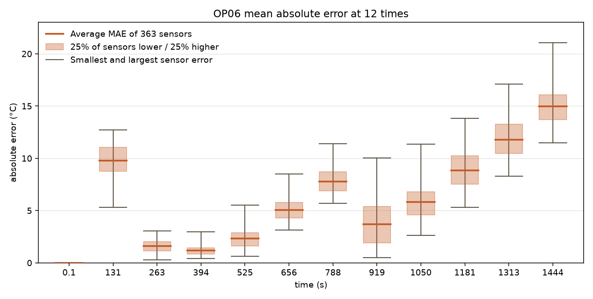

# Konfiguration A, POC nach Stufe 5 — 22.09.2026, abends

> **Wenn du nur eine Zeile liest:** Der CNN ist rettbar. Alle drei Seeds
> unterbieten die trivialen Latten, die Seed-Streuung ist von **22 °C auf
> 0.4–0.9 °C** gefallen und damit zum ersten Mal lesbar. Aber der Fehler ist
> **nicht gleichmäßig über die Trajektorie verteilt** — er läuft auf OP06 von
> 1.1 °C in der Mitte auf 15 °C am Ende, und das ist ein eigener Befund.

**Lauf:** [`GridCNN/laeufe/15_konfigA_poc.txt`](GridCNN/laeufe/15_konfigA_poc.txt) ·
**Parameter:** [`15_konfigA_parameter.md`](GridCNN/laeufe/15_konfigA_parameter.md) ·
**Plot:** [`15_konfigA_OP06_fehler_ueber_zeit.png`](GridCNN/laeufe/15_konfigA_OP06_fehler_ueber_zeit.png)
**Commit:** `bcb6c00` (PR #46) · Tesla T4, torch 2.6.0+cu124

```bash
python3 GridCNN/train.py --no-physics --seeds 3 --epochs 40 \
    --subsample 10 --inner-steps 25 --tbptt-start 4 --tbptt 16 \
    --val-every 2 --device cuda --cache data_cache
```

11 427 Parameter, 11 Trainings-OPs, 2 Halte-OPs, `--subsample 10` → dt = 1 s,
**1445 Zeitschritte** je OP. Adiabat, reine Blackbox.

---

## 1. Was herauskam

| | Seed 0 | Seed 1 | Seed 2 | **berichtet** | Latte | Güte |
|---|---|---|---|---|---|---|
| **val-MAE OP06** | 6.736 | 6.843 | 6.133 | **6.571 ± 0.383** | 10.7995 | **0.61x** |
| **val-MAE OP09** | 5.955 | 4.884 | 6.600 | **5.813 ± 0.867** | 7.7663 | **0.75x** |

Berichtet ist je Seed der Median über das letzte Drittel der Messpunkte
(7 von 21), nicht die letzte Epoche und nicht das Beste.

### Gegen den Lauf vom 22.09., vormittags

| | vorher (`k=1`) | jetzt (`k=4→16`) |
|---|---|---|
| OP06 | 27.11 ± 22.26 °C | **6.57 ± 0.38 °C** |
| OP09 | 24.99 ± 23.22 °C | **5.81 ± 0.87 °C** |
| Seeds unter der Latte | 0/3 und 0/3 | **3/3 und 3/3** |
| Seed-Streuung | 22–23 °C | **0.38 / 0.87 °C** |
| Lesbarkeitsschwelle (~1 °C) | weit darüber | **darunter** |

> ⚠ **Kein direkter Vergleich.** Der alte Lauf lief bei `--subsample 2`
> (~8040 Schritte), dieser bei `--subsample 10` (1445 Schritte). Der kürzere
> Horizont ist die **leichtere** Aufgabe. Was der Vergleich trägt, ist die
> Richtung und die Streuung — nicht der Faktor 4 im Mittelwert.

### Die Diagnose vom Vormittag war richtig

Der Bericht vom 22.09. nannte als Ursache: *ein Schritt trainiert, ~8040
gemessen*. Genau diese Lücke hat `--tbptt` geschlossen, und genau die
vorhergesagte Wirkung ist eingetreten. Es lag an der Schleife, nicht am Netz.

---

## 2. Die Latten sind zeichengleich mit dem Basisprojekt

`PINNmodulusTwo/FAHRPLAN.md:1244` führt für dieselben Halte-OPs:

| | Mittelwert | Persistenz |
|---|---|---|
| PINN-Projekt | 10.801 / 7.762 | 16.679 / 18.549 |
| **dieser Lauf** | **10.7995 / 7.7663** | **16.6699 / 18.5408** |

Übereinstimmung auf drei bis vier Nachkommastellen. Das ist **kein
Kosmetikbefund**: es belegt, dass der GridCNN-Ladepfad dieselbe Haltemenge
baut wie das Basisprojekt, und macht die Zahlen direkt vergleichbar. Genau
dafür wurde `data.py` importiert statt nachgebaut.

### Damit lässt sich der CNN zum ersten Mal einordnen

| | OP06 | OP09 | besser als Mittelwert-Latte |
|---|---|---|---|
| **PINN** (01.09., `w_bc=0.1`, **ein Seed**) | 6.270 | 3.585 | 42 % / 54 % |
| **GridCNN A** (dieser POC, 3-Seed-Median) | 6.571 ± 0.38 | 5.813 ± 0.87 | 39 % / 25 % |

**Auf OP06 praktisch gleichauf, auf OP09 deutlich zurück.** Drei Vorbehalte,
alle zugunsten des CNN:

* Die PINN-Zahl ist laut `FAHRPLAN.md:2233` **ein Seed**. Der Fahrplan des
  Basisprojekts sagt dazu selbst: *„6.27 gegen 6.51 ist kein Ergebnis, wenn
  Streuung über Seeds daneben fehlt."*
* Dieser Lauf ist **adiabat** und **reine Blackbox** (Arm A, null Physik in
  der Architektur). Der PINN hatte einen Randterm.
* Dieser Lauf lief bei 1445 statt ~8040 Schritten.

Ein Blackbox-CNN mit 11 427 Parametern landet adiabat auf OP06 neben einem
PINN mit Randbedingung. Das ist ein Ergebnis.

### Aber das Ziel ist ~1 K

`GridCNN/README.md:903` nennt das **~1 K-Ziel**. Beide Modelle sind Faktor
4–6 davon entfernt. „Schlägt die Latte" heißt **„hat etwas gelernt"**, nicht
**„ist brauchbar"**. Die bestandene Hürde war die niedrige.

---

## 3. Der eigentliche neue Befund: der Fehler ist nicht gleichmäßig verteilt



Der Plot zeigt den Betragsfehler aller 363 Gitterpunkte an zwölf Zeitpunkten
auf OP06. Abgelesen:

| t [s] | 0.1 | 131 | 263 | 394 | 525 | 656 | 788 | 919 | 1050 | 1181 | 1313 | 1444 |
|---|---|---|---|---|---|---|---|---|---|---|---|---|
| **Median [°C]** | ~0 | **9.8** | 1.6 | **1.1** | 2.4 | 5.1 | 7.8 | **3.7** | 5.8 | 8.9 | 11.8 | **15.0** |

Drei Dinge stehen darin, die der Mittelwert `6.57 °C` vollständig verdeckt:

**1 — Bei 394 s ist das Modell am Ziel.** 1.1 °C liegt **auf dem ~1 K-Ziel**.
Der CNN kann die Aufgabe; er hält sie nur nicht durch.

**2 — Zum Ende läuft er weg.** Ab 1050 s monoton: 5.8 → 8.9 → 11.8 → 15.0 °C.
Das ist **O13**, der Spätfehler, in Reinform. Und bei 1444 s ist der
**kleinste** Fehler über alle 363 Punkte noch **11.5 °C** — also liegt das
*ganze Feld* daneben, nicht ein paar Stellen. Das ist ein **Pegelfehler**,
keine Streuung.

**3 — Zwei auffällige Dellen, und eine davon spreizt.** Bei 394 s und bei
919 s fällt der Fehler ein. Bei 919 s spreizt die Verteilung dabei stark
(0.45 bis 10.0 °C über die Sensoren), während sie sonst eng ist.

> **Hypothese, nicht Befund:** So sieht ein **Vorzeichenwechsel** eines
> feldweiten Pegelfehlers aus — beim Nulldurchgang ist der Betrag klein und
> die Spreizung groß. Der Plot zeigt nur Beträge und kann das nicht
> entscheiden. **Deshalb misst `train.py` ab jetzt den vorzeichenbehafteten
> Bias je Abschnitt mit** (Abschnitt 5). Der nächste Lauf beantwortet es.

### Warum das ausgerechnet Arm A trifft

`GridCNN/model.py` sagt zur Delta-Form ausdrücklich, sie sei eine
**Hypothese**:

> „`residual_output` ist in `PINNmodulusTwo` aus, weil es den Level ohne Leck
> trägt und jeden Rollout weglaufen lässt. Hier sollte der dissipative
> Diffusionskern dieses Leck liefern. Läuft der Rollout trotzdem weg, war die
> Hypothese falsch."

**In Arm A gibt es diesen Diffusionskern nicht.** `--no-physics` setzt
`rate = g_θ`, ohne Laplace-Term. Es existiert also kein dissipativer
Mechanismus, der den Pegel zurückholt — und der Plot zeigt genau das
vorhergesagte Bild.

Das ist der stärkste inhaltliche Grund für **Arm B**, den es bisher gab: die
Physik in der Architektur ist nicht „der nächste Punkt auf der Liste", sie ist
die **Behandlung für die beobachtete Krankheit**.

---

## 4. Was der Lauf sonst noch zeigt

**Die Frühphase ist instabil, die Spätphase ruhig.** Bis Epoche 11 (`k ≤ 8`)
gibt es echte Ausbrüche: Seed 1 bei ep 8 mit `|g| 203` und 63 % Sättigung,
Seed 2 bei ep 4 mit 90 %. Ab `k ≥ 9` ist es in allen drei Seeds ruhig und
bleibt es; ein einzelner Rückfall bei Seed 0, ep 38 (6.6 %).

> ⚠ `k` und Trainingsfortschritt sind hier **vermischt** — die Epochen 1–11
> sind zugleich „kleines Fenster" und „frühes Training". Der Befund ist ein
> Hinweis auf `--tbptt-start 8`, kein Beweis.

**Clipping und `--clamp auto` haben getan, wofür sie gebaut wurden.** `|g| 203`
ist die Norm **vor** dem Klemmen — der Schritt selbst blieb bei 1.0. Und
`clamp auto = 11` (±106 °C) hat die Ausbrüche der Frühphase gefangen und
gemeldet, statt sie bei ±480 °C durchzulassen.

**Die Streuungsverhältnisse sind gesund.** `Streuung Ort` liegt in der
Spätphase bei 1.0–1.2: das Modell trägt so viel räumliche Struktur wie die
Wirklichkeit. Nicht flach, nicht über-strukturiert.

**Die val-Kurve schwankt noch.** Seed 2: 4.43 (ep 26) → 6.64 → 7.85 → 5.69
(ep 40). ±3 °C innerhalb eines Seeds. Der Median über sieben Punkte fängt das
ab, aber das Training sitzt noch nicht in einem ruhigen Minimum — dafür wäre
EMA da.

**Laufzeit.** 3.1 s (k=4) bis 8.4 s (k=16) je Epoche, rund **15 Minuten** für
alle drei Seeds. Budget ist also da.

---

## 5. Was daraufhin gebaut wurde

| | was | warum |
|---|---|---|
| **Fehlerprofil** | `val_auswertung` zerlegt die Trajektorie in sechs gleich lange Abschnitte und meldet MAE **und vorzeichenbehafteten Bias** je Abschnitt | genau der Plot oben, als Zahl unter jedem Lauf statt als Handarbeit |
| **`drift`** | `MAE(letzter Abschnitt) / MAE(gesamt)`, gemeldet ab 1.5 | die eine Zahl, die O13 sichtbar macht. Für diesen Lauf ~2.0x |
| **Bias** | vorzeichenbehaftet, gesamt und je Abschnitt | entscheidet „zu warm oder zu kalt" — und damit die Hypothese aus Abschnitt 3 |
| **Wandterm** | `_wall_ghost` behauptete, Stufe 2 fehle. **Stufe 2 ist durch.** Die Sperre war abgestanden | ein abgestandener Blocker ist schlimmer als ein offener: niemand sieht nach |

Alles in `GridCNN/train.py`, mit Tests. Der Drift-Test rechnet ein linear
wegdriftendes Netz in geschlossener Form nach (`34.5 / 19.5 = 1.769`), statt
eine Messung zu behaupten.

---

## 6. Was offen ist

1. **Volle Auflösung.** `--subsample 2`, ~8040 Schritte. Der POC ist die
   leichtere Aufgabe; ohne diesen Lauf ist „der CNN trägt" eine Aussage über
   1445 Schritte.
2. **Die CFL-Gabelung für B/C/D.** 110× bei `--subsample 2`, 551× bei 10.
   Für Arm A irrelevant (kein Laplace-Term), für B/C/D ein Blocker.
3. **Der Wandterm ist nicht verdrahtet.** `q_wall_meas` bleibt `None`,
   `t_in`/`mdot` je Zeitschritt fehlen in `op_tensoren`. Beides liegt seit
   Stufe 2 im Bündel.
4. **Die Haltemenge sind zwei OPs.** Es gibt drei Test-OPs (OP13, OP15,
   OP16), auf denen nie ausgewählt wurde — sie sind bisher nie berichtet
   worden.
5. **Der Plot trägt keine Herkunft.** Welcher Seed, welche Epoche, bestes
   oder letztes Modell? Steht nirgends. Ab jetzt erledigt sich das von
   selbst, weil jeder Lauf sein eigenes Profil druckt.

---

## 7. Was dieser Lauf wert war

* **Die Frage ist beantwortet.** „Ist der CNN rettbar" war offen und ist es
  nicht mehr.
* **Die Messung trägt.** Streuung unter der Lesbarkeitsschwelle heißt: ab
  jetzt sind Vergleiche zwischen Armen überhaupt möglich. Das war seit dem
  09.09. nicht der Fall.
* **Der Anschluss ans Basisprojekt steht** — zeichengleiche Latten, und damit
  eine erste belastbare Einordnung gegen den PINN.
* **Der Plot hat etwas gefunden, das keine Kennzahl gezeigt hätte.** Deshalb
  ist er jetzt eine Kennzahl.
