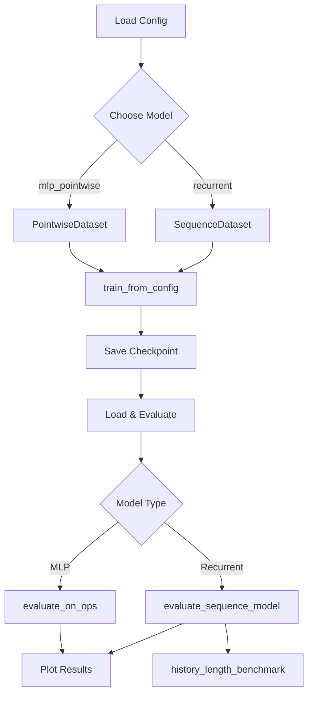

# Model Launcher Notebook

Interactive notebook for training and evaluating battery thermal surrogate models.

## Overview

`model_launcher.ipynb` is a unified control panel for:

1. **Training** MLP or Recurrent models with configurable parameters
2. **Evaluating** on test OPs with comprehensive metrics
3. **Visualizing** predictions, error curves, and history-length benchmarks
4. **Comparing** model architectures and configurations

## Quick Start

```bash
# Navigate to notebooks directory
cd battery_surrogate_agenticWorkflow/notebooks

# Launch Jupyter (from modulus_env)
source ../modulus_env/bin/activate
jupyter notebook model_launcher.ipynb
```

## Notebook Structure

### Cell 1: Setup & Imports

- Sets `PYTHONPATH` to include `src/`
- Imports all required modules
- Detects CUDA/CPU device

### Cell 2-3: Model Selection & Configuration

Choose between two model architectures:

```python
MODEL_TYPE = "mlp_pointwise"  # or "recurrent"
```

Load config from YAML and apply inline overrides:

```python
# Override training params
config["train"]["epochs"] = 10
config["data"]["subsample_time"] = 100  # Faster training

# Recurrent-specific
config["model"]["history_length"] = 8
```

### Cell 4-5: Data Preview & Coverage

- Shows OP split (train/val/test)
- Previews sample bundle dimensions
- Validates coverage (Phase 2)

### Cell 6: Training (In-Process)

**Default mode**: Runs training in the notebook kernel:

```python
summary = train_from_config(config)
print(f"Best val loss: {summary['best_val_loss']:.6f}")
```

**Alternative**: Shell-out for background/HPC jobs (commented cell).

### Cell 7: Load Artifacts

Loads trained checkpoint, normalizer, and config for evaluation:

```python
model = build_model(saved_config, n_sensors=363, seed=42)
model.load_state_dict(torch.load(ckpt_dir / "best.pt"))
normalizer = PointwiseNormalizer.load(ckpt_dir / "normalizer.json")
```

### Cell 8-9: Evaluation & Metrics

- **MLP**: Uses `evaluate_on_ops()` for pointwise metrics
- **Recurrent**: Uses `evaluate_sequence_model()` for rollout metrics

Outputs:
- MAE, MSE, R² for Temperature (T) and Voltage (bc_V)
- Per-OP breakdown
- Error curves (recurrent only)

### Cell 10-11: Visualization

- **Time-series plots**: Predictions vs ground truth for sample sensor
- **Error curves**: Absolute error over time (recurrent only)
- **Scatter plots**: Predicted vs actual

### Cell 12-13: History-Length Benchmark (Recurrent)

Sweeps different history lengths to find optimal k:

```python
benchmark_df = history_length_benchmark(
    config,
    k_values=[1, 2, 4, 8, 16],
    epochs_per_k=1,
)
```

Plots:
- R² vs history length
- Lookback window (seconds) vs k
- Training time vs k

## Configuration Options

### MLP Pointwise

```yaml
model:
  type: mlp_pointwise
  n_hidden_layers: 3
  hidden_size: 128
  swish_beta_init: 1.0
  swish_beta_learnable: true
```

### Recurrent

```yaml
model:
  type: recurrent
  rnn_type: gru  # or lstm
  n_layers: 2
  hidden_size: 128
  history_length: 8  # k lags
```

### Data & Training

```yaml
data:
  train_ops: [OP01, OP02, OP08, OP09]
  val_ops: [OP10, OP11]
  test_ops: [OP16, OP19]
  subsample_time: 50

train:
  epochs: 50
  batch_size: 4096
  lr: 0.001
  early_stopping_patience: 10
```

### Preprocessing (Phase 2)

```yaml
preprocess:
  coords: minmax     # x,y,z → [-1,1]
  time: minmax       # t → [0,1]
  sim_config: zscore # z-score per channel
  targets: zscore    # zscore | robust
```

## Output Artifacts

After training, artifacts are saved to `artifacts/{model_type}/{timestamp}/`:

| File | Description |
|------|-------------|
| `best.pt` | Best model checkpoint (state dict) |
| `normalizer.json` | Fitted normalizer with stats |
| `config.yaml` | Training configuration |

## Workflow Diagram



## Tips

### Faster Iteration

```python
# Reduce data for quick tests
config["data"]["subsample_time"] = 200
config["train"]["epochs"] = 5
config["data"]["train_ops"] = ["OP01"]
```

### GPU Training

The notebook auto-detects CUDA. Force CPU with:

```python
DEVICE = torch.device("cpu")
```

### Comparing Models

Run the notebook twice with different `MODEL_TYPE` settings:

1. Run with `MODEL_TYPE = "mlp_pointwise"`, save metrics
2. Run with `MODEL_TYPE = "recurrent"`, compare

### Production Checkpoints

For deployment, load only what's needed:

```python
import torch
from battery_surrogate.model.registry import build_model
from battery_surrogate.model.normalizer import PointwiseNormalizer

model = build_model(config, n_sensors=363, seed=42)
model.load_state_dict(torch.load("artifacts/mlp_pointwise/best.pt"))
normalizer = PointwiseNormalizer.load("artifacts/mlp_pointwise/normalizer.json")
```

## See Also

- [configs/model/mlp_pointwise.yaml](../configs/model/mlp_pointwise.yaml): MLP config template
- [configs/model/recurrent_pointwise.yaml](../configs/model/recurrent_pointwise.yaml): Recurrent config template
- [README_evaluate_sequence.md](../src/battery_surrogate/model/README_evaluate_sequence.md): Evaluation module docs
- [README_DATA.md](../README_DATA.md): Data pipeline documentation
